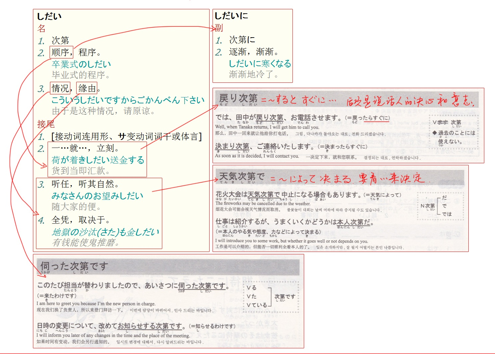
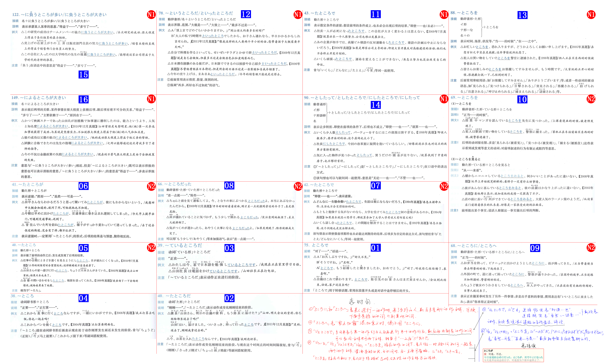

## 〜あげく(に)

Vた / N＋の　＋　挙げ句(に)

到头来

> どの大学に留学しようかと、さんざん悩んだあげく、A大学に決めた
>
> 留学する 变意志 → 留学しよう　即 留学しましょう 到底去哪留学呢
>
> 散々　一而再再而三  理解成33，再三

后项带有消极意义，还可以是 甲斐挙げ句の果てに 表后项结果更严重

## あまり(に)

> あまり＋肯定
>
> 非常
>
> あまり美味しかったので、つい食べすぎてしまった
>
> 
>
> あまり...ない
>
> 不怎么 / 不太
>
> 
>
> 数量词＋あまり
>
> 表超过该数量有余
>
> 余る→余ります→余り
>
> この学校には一万人余りの学生がいます

V原 / A2＋な / N＋の　＋　あまり

因过于...而...，表由于程度过甚导致某种结果

> 試験の結果を気にする**あまり**、夜眠れなくなちゃった
>
> てしまう　非自愿发生的完结

常与表状态或感情的词一起使用，忙しさ、驚き、嬉しさ、喜び、悲しみ、感激、心配，前不能加A1所以要变成N，即N＋の＋あまり

## 〜以上(は)(いじょう)

既然...就

意思相同 以上は　上は　からには　のだから

后项常接表决心、义务、建议、推量等表达说话人意志的内容

> 留学する以上は、勉強だけでなく、その国の文化を学んだり交流をしたりしたいと思う
>
> だけでなく　不只是　等价のみならず
>
> たり...たりする　动作列举，和过去式无关，可以拆开可以合并

> 单独的 以上 还可以表示
>
> 比...之上还多
>
> 演讲结束，以上

## ～上(うえ/じょう)

N　＋

じょう　じょうは　じょうも

の上では　の上でも

在...上，...方面，根据...来看

〜上の　后加名词作定语用

〜上　前面常接　教育きょういく、歴史れきし、仕事しごと、技術ぎじゅつ、経済けいざい

> 新型コロナウイルスなど、長い人類の歴史**の上では**多くあるうちのほんの１つの流行り病でしかない

Vる / A1

A2＋な / である　N＋の / である

＋上(に)

不但...而且...

前后项必须是同一性质的，同为积极同为消极

类似それに、だけでなく、のみならず

类似　それに

> あいつは性格が悪い**上に**見栄っ張り
>
> 今日は寒い**上に**風が強い

Vた / N＋の　＋

上　上で　上の　上での

强调主观人的意志，在完成前项的基础上做后项

类似　てから

> 内容をご確認**の上**、三日以内にご返信ください
>
> ご理解いただけた**上での**ご参加をお願いします

Vる　＋　上は

既然...就

类似　以上は　からには　のだから

> 目標を決めた上は、それに向かいって前向きに行動しなきゃ
>
> こうなった上は、覚悟を決めて最後まで頑張るしかない

## からには / からは

既然...就...

> 言い出した**からには**実行してもらいたい
>
> 約束した**からには**、どんなことがあっても守らなければならない

## 得る(うる) / 得ない(えない)

> 得る可以读うる / える　变形时按照える变换
>
> 有り得ない(ありえない)　不可能会有
>
> 有り得る　可能会有

V第一连用　＋　得る

表可能性，能不能，会不会

只表示可能性，不表现能力；可能形的变形是可以表示可能性，又可以表示能力，即可以能够

> 彼のとった態度は、私には十分理解しうるものであった
>
> こんじょうがないと、この目標をたっし得ないでしょう

## 〜甲斐がある(かいがある) / 甲斐がない / 甲斐もなく

Vた / N＋の　＋

有...的价值/意义

> 遣り甲斐(やりがい) 有价值，值得　后缀时浊化

> 希望を持って楽しく生きなければ、生まれた甲斐がない

## がきっかけで／がきっかけになって／をきっかけにして / をきっかけとして

N　＋　

动词要名词化+の形式体言

> が客观的自然而然变化　を人为主动去做

以...为契机

> 失恋**をきっかけに**髪をばっさり切った
>
> 恵まれない子供達の姿を見たの**がきっかけで**、このしえんかつどうを始めたのです

## 〜が契機で / が契機になって / を契機にして / を契機として

N　＋　

动词要名词化+の形式体言

以...为契机

书面语

## 限

### 作为V时

#### に限る

Vる/ない / N　＋　に限る

仅限（仅限周二半价）

好吃不过饺子

> 寒い日は、熱々の鍋**に限る**
>
> やはり夏は冷たいコーラ**に限る**ね

相当于 ～のが一番いい，一般是普遍认可的事情

#### に限って

N　＋　に限って

仅限（仅限周二半价）

唯独...，偏偏...

> 予習していない時**に限って**、先生に当てられる
>
> 大切な用事があって遅刻してはいけない時**に限って**、寝坊してしまう

#### に限り

N　＋　に限って

仅限（仅限周二半价）

> お葉書を送りくださった皆様の中から百名様**に限り**、素敵な商品をプレゼントいたします
>
> 毎週火曜日**に限って**、映画は半額になります
>
> 16歳未満の方の入場は保護者同伴**に限ります**

〜に限って、〜に限り用于中顿，〜に限る用在句末

### に限らず

N　＋

不仅...而且...

> 東京ディズニーランドは子供**に限らず**、大人にも大人気だ

表不局限于某个范围之内，后面常跟　も

### とは限らない

不见得...，未必...

> 実力のあるチームがいつも勝つ**とは限らない**、試合はやってみなければわからないのだ
>
> しっかり鍵をかけないと、泥棒にいられない**とも限らない**から注意してください

类似 必ずしも

> 必ずしも正しくない　未必正确

有时和〜からといって搭配，表 虽说...也未必...

〜ないとは限らない，表 未必不...，相当于 かもしれない，即有可能...

### 作为N时

#### 限り　单词

1. 在...范围内，只要...就　（在这个范围内怎样怎样）

> この点に関する限り君の言い分が正しい
>
> 謝らない限り許さない
>
> 非情の場合はこの限りではない
>
> できる限りお手伝いします
>
> 力のおよぶ限りつくす

2. 限度、极限

> いつかを限りとする
>
> 欲には限りがない
>
> 人間の力には限りがある
>
> 妹と二十年ぶりに再会して嬉しい限りだ

#### 限り(は)

Vる / V可 / N＋の　＋　限り(は)

尽其所能，表最大限度，尽量

> 思ういつく限りのアイデアはすべて出したが、社長は認めてくれなかった
>
> 思ういつく　灵感，想出来创新的东西
>
> 思い出す　回忆想起来，想起过去的事情
>
> てくれる　别人为我做某事

常用 力の限り 用尽全力 声の限り 喊破喉咙 命の限り 拼了老命 見渡す限り 放眼望去

Vる / Vている / A1 / A2な / Nの　＋　限り(は)

只要...就（不只是范围边界线，而是范围内怎样怎样）

> 生きている限り、嬉しいことも悲しいことも必ずある

#### ～限り／限りで／限りでは／限りだと

Vる / Vた / Vている　＋　限りでは

在某个范围内，据...所知

> メニューを見た**限りでは**美味しそうだったが、実際はそうでもなかった
>
> 話を聞いた**限りだと**、相手の方に非があると思う
>
> 知っている**限り**のことを教えます

見る、知る、聞く、調べる等搭配，说话人保有余地，在这个范围内是这样的，范围外啥情况不知道

### 〜ない限り

只要不...就...，除非...否则就...

> この地方は人口がだんだん減っていて、何か対策を立て**ない限り**、今後も増えることはない
>
> 大都会は危険だと言われているが、ここは夜遅く一人で歩か**ない限り**、安全である
>
> 

相当于〜なければ，后项常与否定呼应，〜ない限り〜ない，表不得不

## かけだ / かける / かけた / かけの

表示动作开始后还没结束

刚开始做，做到一半，有一种尚未完的感觉；包含刚开始的意味

> テープルの上に食べ**かけの**ケーキが置いてある
>
> てある　人为出于某个目的做他动词动作，物品处于被...的状态
>
> 他动词前面的を改成が
>
> 置いてある　放的有
>
> 
>
> 家の前で死に**かけ**ていた野良猫を拾って動物病院に連れて行った
>
> 死にかける　开始死亡但是没彻底凉透，奄奄一息

かけた　刚开始

> お風呂にはい**かけた**ときに電話が鳴った

かけの　做到一半

> 遅刻しそうになったので、食べ**かけの**パンを冷蔵庫に入れて家を出た

かけるとき / かけたとき　...的时候，不用の

## 〜かねる / かねない

V第一连用　＋　

肯定表否定，不能、不方便，婉言谢绝

包含即使想做某事也很难做到的意思，常用 決めるに決めかねる(难以决定)　見るに見かねて(不忍目睹)

表委婉谢绝，常用 分かりかねます(不知道)　出来かねます(不能)

> 怪我した子猫を**見るに見かねて**、動物病院へ連れて行った

类似 ことができない 客观不能

否定表肯定，有可能会发生不好的事情

> 私は忘れっぽいほうなので、こんな所に傘を置いておくと、帰りにまたわせれ**かなない**
>
> っぽい　有倾向，有这个体质
>
> 置いておく　事先放置
>
> と　表假设

类似 かもしれない 也未可知　恐れがある

N　＋　

兼任

## 〜かのようだ

か表对前项的不太确定性

就好像是...一样

> もう秋になるのに、今日の暑さはまるで真夏に戻ったかのようでエアコンをつけた家も多かったらしい

和ようだ一样

## ～からいいようなものの／からいいものの／からよかったものの

> ものの　＝　转折が
>
> ものを　＝　のに

因为…幸好没…（但…）

虽然这次避免了某种不好的事态发生，但是不能掉以轻心

> あなたがたまたま確認してくれた**からよかったものの**、もう少しで原稿の締め切りに間に合わな苦なる所だった
>
> ところだった　描述当时那个场面差点...，险些

## 〜からこそ

正因为...

こそ表强调，强调这个原因很重要，说话人主观判断，一般不用于表负面原因，だけに表负面

> 好きなことを職業にする人が多いが、私は映画が好きだ**からこそ**、職業にはしないことにした
>
> そんなにうるさがってはいけません、あなたのことを思っている**からこそ**色々注意するのですから
>
> うるさい第一人称/第二人称疑问句　→　うるさがる第二人称陈述句/第三人称　→　うるさがって

## 〜わりに(は)

Vる / A1 / A2＋な / N＋の　＋　わりには

虽然...但是，比起...

表由前项理所当然想到某个结果，可实际上不是这个结果。后项与前项不搭配，不协调，类似にしては

> 雨が降っている**わりには**あまり寒くない

## 〜気味(ぎみ)

V第一连用 / N　＋　気味

稍微有点...

用于主观感觉，多用于不好的事情

> 昨日から風邪**気味**で、だるくて何もする気になりません
>
> 固定搭配
>
> 風邪気味　有点感冒
>
> 熱っぽい　感觉发烧
>
> 最近食べ過ぎのせいか、太り**気味**だ
>
> せい 不好的原因 ＋か表不确定 ＋て表就是这个原因
>
> 
>
> 気味 倾向程度偏低
>
> っぽい 倾向程度偏高
>
> がち 次数多
>
> 遠慮がち　客气、谦虚（特例）

> 疲れる→疲れ気味　感觉有点累，只有一点点
>
> 疲れっぽい　感觉很累了，再做些啥真的就顶不住了
>
> 疲れがち　次数很多，老是累

## 〜きり / きりだ

> 做一个事情，突然被砍掉了

Vる/た / N　＋　きり

表限定，只有...

> 一回**きり**の人生だから、楽しく過ごしたい

きり暗示本来自己希望多一些，有更多主观，だけ客观描述

Vた　＋　きり / きりだ

前项发生后再也没有发生后项、前面一个动作就是最后一个动作

> 卒業した翌年に一度あった**きりだ**

## 〜げ

A1词干 / A2　＋　げ

...的神情

> 彼女は何か言いた**げ**な顔をしてこちらを見ている

意味ありげ　意味深长的神情

## 〜ことから

N接续

表原因或依据，因为...，从...来看

> 都心では、子供が少なくなっている**ことから**、学校の数も減りつつある
>
> つつある类似ている　表正在进行
>
> つつある有不断变化的意思，ている仅表示状态
>
> 減りつつある　昨天100，今天50，明天更少，不断在减少
>
> 減っている　之前减少了，现在变得很少这个状态
>
> 
>
> 指紋が一致した**ことから**、彼は犯人に特定された
>
> から加强版

## 〜ことだから / ことだ

N＋の＋ことだから

以我对你的了解，主观推断，因为他就是这么个人，所以...

> 彼**のことだから**、これからも自分の道を自分で切り開いていくだろう
>
> 山田さんはもともと世話ずくで、誰に対して親切だ。そんな彼女のことだから困っている友達をほうっておけなかったのだろう
>
> 放っておく　置之不理

## ～ことなく／ことなしに／こともなく

Vる　＋

表否定

> 失敗を恐れる**ことなく**、行動してほしい
>
> 苦難に耐える**ことなしに**、成功など、決してあり得ない

相当于ないで / ずに

## 〜ごとに

Vる / N　＋

每当，人人有份一个都不少

>  この目覚まし時計は五分**ごとに**鳴るように設置されている
>
> 秋葉一雨**ごとに**涼しくなるという季節だ

表反复出现的完整的事情的每一次

ごと

人人有份，并发，发牌的时候每个人都直接发

ずつ

轮着来，串行，发牌的时候，先选出黑桃发再选出红桃发...，每发完一张牌后会少一张

おき

隔着一个，一排的灯，一个亮一个不亮

## 〜ことにはならない

Vる / Vた / A1 / A2　＋

不能当作...，不能算作...

> いじめられたからと言って、いじめ返してもいいという**ことにはならない**
>
> やり終わった作業の見直しまでしないと、仕事をやり遂げた**ことにはならない**
>
> 見直す　重新审视
>
> やり終わる　我停工了，觉得事情做完了
>
> やり遂げる　别人来验收工作合格，全部完成

## 〜ことは〜が

表让步，...是...但...

虽然承认前项，但并不能给予肯定，后项提出消极的方面，前后项是同一个动词或形容词

> このレストランは美味しい**ことは**美味しい**が**、値段が高すぎる

## 〜際は(さいは) / 際に(は)

Vる / Vた / N＋の　＋

在...时候，借...时机

> お近くにお越しの**際には**、ぜひ我が家に寄りください

際に

Vる / Vた / N＋の　＋

表进行某种活动或出现某情况，这时要如何处理，当...之际

前项一般是动作，表进行某种活动或发生的情况

后项多是意志性动词，意志、希望、请求、命令、决定

书面语，重大事项，演讲，寒暄

時

Vる / Vた / N＋の　＋

表...的时候

前项既可是动作又可是状态

后项随意

口头语

## 〜ざるを得ない

> ない　→　ざる　接续和ない一致

Vない　＋

する→せざるを得ない

不得不，情不自禁

书面语，除此之外别无他法，无可奈何

> 雨が降ったら中止せ**ざるを得ない**

### 〜ないわけにはいかない

道理和客观事实的原因而不能不，从道理、人情上来讲

> コロナウイルスで外出制限といっても冷蔵庫何も入ってないし、出かけ**ないわけにはいかない**

なければならない　法律法规道德习惯，没有选择余地的必须

なければいけない　劝告，最好，有选择余地的必须

### 〜ないではいられない / ずにはいられない

从感情上，主观觉得不能不，情不自禁做某事

ないでいる　表有意识地采取否定行动，结果仍在继续 ご飯を食べないている

ないでいる→ないでいられる→ないでいられない→ないではいられない

ている→て(は)いられない→　てばかりはいられない　←てばかりいる

> 台風の被害にあった人々のため、一日も早い生活環境の整備を願わ**ずにはいられない**

てはいられない／てもいられない／てばかりはいられない／てばかりもいられない

不能...，不能总是…

表迫于某种情况，不能再继续以前的状态，或急于做某事，包含危机感和紧迫感

> 仕事もまだ残ってるから、休ん**でもいられない**
>
> どんなに辛くても、泣い**てばかりもいられない**、もっと強く生きていかなきゃ

### ざるを得ない

有 ないわけにはいかない、ないではいられない意思，书面语

还可以表 やむをえない 表所提出的结论与自己的想法相反，而不得不，体现无可奈何

### 〜ないではおかない / ずにはおかない

主语多是客观事物，从客观事物的发展来看，必然要达成某种状况。以人作主语时，把人当作客观存在来看待

不会在没有...的情况下就放下他→必然会引起→一定要达到

ておく　事先做好某事，然后就放着

ないでおく　没做的情况下就放着　→　ないではおかない　＝　必ず〜する　必ず〜するに至る　必然达到某种情况，不会轻易放弃

> 息子は一流の音楽家になると言って家を出た、大変だが、きっと目的を達成しないではおかないだろう

固定用法 感動させずにはおかない　必定会使...感动　言わせずにはおかない　必定要让其说出来

## 次第

## 末(に)(すえに)

Vた / N＋の　＋

表结果，经过一番...最后终于...

> こん新しい薬は、何年にもわたる研究の末に作り出されるものだ
>
> にわたる　长达...，距离多宽...，时间跨度，空间遍布范围

挙げ句通常是负面的，末 只表示最后结果

强调经历了一个很长的过程，最终产出某个结果

## 済む

### て済む

Vて　＋　済む

N＋で　＋　済む

...就解决了，...就顺利了结

否定为 て済むことではない

> 薬で**済む**病気だから、入院する必要はない
>
> 大事な書類を無くしてしまったなんて、謝って済むことではない

### ずに済む / ないで済む / なくて済む

> なくで　表原因，其他都用ないで

不...也顺利了结

本来想做，不做也行；避免了可能会发生的事情

> 幸い友人が冷蔵庫をくれたので、新しいのを買わ**なくて済んだ**
>
> 今朝乗っていた電車が一時運転見合わせになったけど、早めに家を出たので遅刻**せずに済んだ**
>
> 見合わせる　互相看，看情况才知道→暂停

### ずにはすまない / ないではすまない

すみます→すみません　这个事不会就这么完了，心里过意不去，还没完

不...过意不去

> 自分のせいで、相手に損害を与えたのだから、弁償せずにはすまない

常与 謝る、弁償する、責任を取る、返す 搭配使用

## 〜たいばかりに / ほしいばかりに

V第一连用＋たいばかりに

N＋が＋ほしいばかりに

> ばかり 只　に 因果　→　只不过是因为想要...就...

表为了实现某愿望而不辞劳苦不择手段去做某事

> ブランドバッグを手に入れ**たいばかりに**、夏休みは一生懸命アルバイトをした

ばかりに　动作

引き受けたばかりに、ひどい目にあった　做了接受的动作

だけに　状态

値段が安いだけに品がようない　只是描述状态

## だけ / だけあって / だけに / だけのことはある

だけあって　先知道B，再来找B的原因是A，A和B都是既定

だけに　A既定，B假设，由A推导B

> 我摸不到篮筐，姚明能摸到，只有姚明才能摸得到篮筐，他有与之相称的身高，不愧是他长这么高

与...相称、不愧是...

表与其身份地位经历等相称，后项对其正面评价，常与 流石に 呼应使用

> 多くの観光客が訪れる**だけあって**、確かに山からの眺めは素晴らしかった
>
> 多くの観光客が訪れる　果
>
> 確かに山からの眺めは素晴らしかった　因

だけに

正因为...更加

相当于〜だけに、尚更(なおさら)...，表正因为前项原因，后项才更加

> 苦労して編んであげたマフラー**だけに**、彼氏が喜んでくれてよかった
>
> 苦労して編んであげたマフラー　既定的
>
> 彼氏が喜んでくれてよかった　假设

正因为...反而...

相当于 〜だけに、かえって，表正因为...反而更加...

> 優勝することを期待していた**だけに**、負けた時の失望は大きかった

翻译成正因为就可以了，不用考虑后面，看句子意思就能知道

## ところ

## 〜た途端に(とたん)

Vた　＋　途端(に)

刚、一、就

前项刚一发生就发生后项，后项多是意料之外，说话人亲历的已经发生的事情，只能是描述画面，后项不能是命令意志推量等

> 私と付き合えないと分かっ**た途端**、それまで優しくしてくれた人たちが冷たくなって離れていく

## 〜序でに(ついで)

Vる/た / N＋の　＋　序で(に)

顺便，前主后次和中文一样

> 母は駅まで客を送って行った**序でに**買い物をしてきた

## 〜っこない

> くる→こない　っ可以理解为ということが　这样的事情来不了

V第一连用　＋

强烈否定，不可能

> 一日十時間も勉強するなんて、私にはできっこないよ

类似　はずがない、訳がない

## 〜つつ

V第一连用　＋　つつ

一边...(次要)一边...(重点)

> 辞書を引き**つつ**英字新聞を読んでいる
>
> 查东西用引き，古代的书一卷一卷，要拉出来看

类似ながら，更书面

V第一连用　＋　つつ(も)

虽然...但是...

> もう起きなければと思い**つつも**、なかなか起きられない
>
> タバコは体に悪いと知り**つつも**、つい吸ってしまう
>
> つい
>
> 刚刚
>
> つい先日
>
> 不知不觉、无意中
>
> ついしゃべってしまった
>
> 最终
>
> ついの別れ

相当于 けれども / のに

## 〜つつある

正在进行时

ている　没有前进的感觉，只是正在，正处于...的状态

つつある　有个目标，不断往目标前进，正在不断地...

> 政府は景気が緩やかに回復し**つつある**と発表した

## 〜っぱなし

V第一连用　＋

前为他动词，本该做的事情却没做，置之不理、放置不管

多用于负面评价

常用 置きっぱなし、出しっぱなし、あけっぱなし

> ドアをあけ**っぱなし**にしてだかけました　重点在说门应该关但没有关，放置不管
>
> ドアをあけたままにしてだかけました　门在开着的状态下出去了，门在维持开的原状

Vた＋まま　重点在于维持原状

Vる＋まま　听凭，听你的就好，随便

Vた＋きり　强调前面动作是最后一个动作，后面再也没有其他动作

前接自动词，表状态的持续，不谋求改变，一直...

> 電車の中はあいにく空席がなくて、ずっと立ち**っぱなし**だった

立ちっぱなし、座りっぱなし、動きっぱなし、空きっぱなし

## っぽい

気味

发生了，程度很低

っぽい

并没有真正发生，有某种感觉或倾向

がち

次数多，总是

げ

A1词干 / A2　＋げ

...的神情，...的样子，用于表情神态

只有ありげ前是动词   意味ありげ　意味深长的

疲れ気味　真的出现了累的情况，自我感觉有一点累了

疲れっぽい　并没有出现累的情况，但我是容易累的体质，让我做些啥可能真的就累了　

疲れがち　真的出现了累的情况，而且累了好多次，动不动就累

女っぽい男　很像女人的男人，差一点就变女人了但还不是

女らしい女　很有女人味的女人，有女人典型特征

女みたい豚　ようだ、ような、ように的口语，像女人的猪，单纯比喻

固定搭配

風邪気味　熱っぽい

.jpg)

## 〜てからでないと / てからでなければ

> てから　先做前项再做后项  でないと　如果不是先...那就...，と假设

如果不先做某事就无法做后项

> まずはやってみ**てからでないと**、できるかできないかは分からない。

## 〜てでも / てまで

Vて　＋でも

表采取强硬手段，就是...也要...

表为了达到某一目的而采取强烈手段，后项表达了说话人的强烈愿望和意志

> 家を売っ**てでも**子供の手術の費用を用意いたい

てまで

Vて　＋まで

表程度，甚至不惜...

为了目的不折手段，所做超出常理

> 借金してまで遊びに行ったと聞いて、あきれてしまった

## 〜のではあるまいか

Vる / A1　＋　のではあるまいか

A2 / N　＋　なの

> まい和ない接续一致
>
> まい为ない的意志形或推量形
>
> 意志形 - 不想、不要
>
> 推量形 - 应该不会吧 同ないでしょう

委婉表达自己主张，比のではないか书面化，一般看到のではあるまいか、のではないか就代表前面的东西是肯定，忽略这句委婉的话

> 彼は最初から何もかも全部わかっていた**のではあるまいか**
>
> 何もかも　一切、全部

遅れたではないか　你来的好晚啊，责备语气

遅れたのではないか　会不会是来晚了，有一定推测语气

## ～てはいられない

> ている　持续状态
>
> ていられる　能够持续这种状态
>
> ていられない　不能够持续这种状态
>
> てはいられない = ていられない = てられない = てらんない　口语变化
>
> ないている　一直处于不...的状态
>
> ないでられない　以前都是不...的状态，现在不能像以前那样保持一个不...的状态，即情不自禁不由自主的不得不

不能...

迫于某种情况，不能再继续以前的状态，或急于做某事，包含危机感紧迫感

> 見てらんない　看不下去了
>
> 来週は大事な期末試験なので、のんびりし**てはいられない**

## 〜てばかりはいられない / てばかりもいられない

不能像以前那样一个劲地光处于某种状态

表说话人对现状的不安，不能总这么下去，不能沉浸在

> どんなに辛くても、泣い**てばかりもいられない**。もっと強く生きていかなきゃ
>
> 体の調子が悪いからと言って、このまま会社を休ん**でばかりはいられない**

## 〜て始めて

在...之后才...

之前没有开始，经历过前项的事情后才开始

> 一人で暮らすようになって始めて、家族がどんなにありがたいかがわかった
>
> Vる/可＋ようになる　变得...
>
> ありがたいですか→ありがたいか　家人是多么的重要啊

## 〜では済まされない / では済まない

N / V　＋

> 済む→済ませる→済ませられる→済まされる　不表被动表可能，使役可能
>
> 不能够让他完结
>
> では　的话

如果...的话不能解决问题，如果...的话是不行的，这怎么行呢

表某事不能迁就不被允许

> この物語はただの笑い話**では済まされない**と思うところがある
>
> 直译：这个故事只把他当做笑话来看这怎么行呢

## 〜と言うものではない / と言うものでもない

表否定，并非...

说话人认为某个想法或说法并不全面

类似(と言う)わけではない，但这个范围很广，と言うものではない只能用于想法说法

> 物を売るときは、値段が安ければいい**と言うものではなく**、商品の質を第一に考えるべきだ
>
> ない→なくて，去掉了て改中顿

## 〜と言うより

> より　都是与前项相比

普通形 / A2 / N　＋

与其说...，还不如说...

类似むしろ

> 山田さんは書物が大好きで、技術者と言うより学者と言ったほうがいい
>
> ほうがいい是A和B两个相比，觉得A比较好，这个A的动作一定要是做了后才能拿来比较，故ほうがいい前面一定是Vた

## 〜といっても過言ではない / といっても言い過ぎではない

表评价，即使...说也不为过

> 山田監督は私の恩人です。今の私があるのも山田監督あってのことだ**といっても過言ではなりません**
>
> あっての　没有共产党没有新中国
>
> インターネットの普及とともに、あらゆる情報が溢れていて、人々は情報の洪水に投げ出されている**といっても言い過ぎではない**だろう
>
> ともに　同时发生，随着

に過ぎない　只不过...而已

V第一连用 / A1词干＋過ぎ　过度、过分做某事，过于...

## かと思うと / かと思うったら

Vた　＋　(か)と思うと / (か)と思うったら

刚一...就

两件事情发生间隔很短，前后项接连发生；只能用于客观事实；描述现状时，后项不能是命令、意志、否定，平叙，简单描述东西，不加感情色彩

> 急に空が暗くなった**かと思うと**、激しく雨が降り始めた
>
> 赤ちゃんは、泣いていた**かと思うったら**、もう笑っている

Vる / Vた　＋　

后项结果与说话人预期相反，原以为...却...

> 妹は、今勉強を始めたか**と思うったら**、もうリビングでテレビを見ている

### 表　刚一...就

描述客观事实，后项平叙，句子多用过去式，描述已结束的事情

描述自己用次第

なり

Vる＋なり

> 彼はしばらく電話で話していたが、とつぜん受話器を置く**なり**飛び出して行った

〜か〜ないかのうちに

前后为同一动词

> 電車が止まる**か**止まら**ないかのうちに**慌てて乗り込みました
>
> 車から降りる**か**降り**ないかのうちに**家に飛び込みました

〜たとたんに

Vた　＋　たとたん(に)

> 国から来た手紙を見**た途端**、彼女は泣き出してしまった

〜が早いか

Vる / Vた　＋

> 授業終了のベルを聞く**が早いか**、生徒たちは教室を飛び出して行った
>
> 彼女はとても忙しいらし。食事をとる**が早いか**、仕事に向かった

〜や / やいなや

> 否む(いなむ)→否める可以否认→否めない不可否认
>
> や表举例→ Aや否や　A还是不A的时候就...，类似か...ないかのうちに是这样子呢还是不这样子呢
>
> 还没决定清楚的时候，就发生了下一个事情，前项还没稳定下来后项就发生了

Vる　＋

> 電車が駅に止まり、ドアが開く**やいなや**彼は飛び出して行った

## かと思えば

Vる / Vた　＋　(か)と思えば

后项结果与说话人预期相反，原以为...却...

> 息子は学校から帰ってきた**かと思えば、**またすぐ遊びに出かけいた

Vる　＋

表并列，既...又...

> 拾った落し物をわざわざ降板まで届けにいく人がいる**かと思えば**、人の物を盗む者もいる

## かと思いきや

Vる / Vた / A1 / A2　＋　(か)と思いきや

原以为...却...

表达惊讶、意外的预期，后项的结果与前项的预料往往不同或相反

> 今日は暑くなる**かと思いきや**、むしろ寒いぐらいだった

## ～とか

简体 / N　＋　とか / とかいう / とか言うことだ / とか言う話だ

听说是，说是...之类的

不太确定说的东西，但是听过一点点

> 鈴木さんは今日は病気で仕事を休んだ**とか**
>
> ゼルダの伝説**とかいう**ゲームが面白い
>
> ニュースにようると今年の冬は例年より寒い**とか言うことだ**
>
> 田中さんは結婚したら仕事を辞める**とか言う話だ**

> Aと　Bと　完全列举
>
> Aとか　Bとか　不太确定列举，不完全举例
>
> Aや　Bやなど　不太确定列举，不完全举例

とかで

> とか表传闻　で表原因

表听到的理由，说是因为...什么的

> 台風が近付いている**とかで**、飛行機が欠航になった

## どころか

V / A1 / A2 / N　＋　どころか

别说吃肉了，饭都吃不上

否定前项，提出程度更深的后项

> 医者には二、三日で治ると言われたが、よくなる**どころか**ますます悪くなってきた
>
> 改成ばかりか则为别说治好了还能跑了呢，说明医生治的好

ばかりか

貯金どころか赤字になった　别说存钱了，还欠帐呢

貯金ばかりか赤字になった　别说存钱了，都买房买车了

ばかりか 前项正面则后项更加正面，前项负面则后项更加负面，正相关

どころか 无论前项正面负面，后项一定负面，重点在后面

貯金しない　则两个意思一致

## どころではない

Vる / Vた / N　＋　どころではない

不是做某事的场合，不是...的好时机

没有时间、精力、金钱去做某事

> せっかく古い友達が訪ねて来たのに、仕事に追われて一緒に酒を飲む**どころではなかった**

## 〜としか言いようがない

> しか〜ない　除此之外再无其他
>
> V第一连用＋ようがない　无法做某事 (有肝癌没法治)
>
> 注意不要和しようがない混淆

V第一连用　＋　としか言いようがない

只能说是...

> この病気が治ったことは奇跡**としか言いようがない**

## 〜としたら / とすれば / とすると

> とする的ば形和たら

如果...

表假定条件和既定条件，后项表结果、判断、推量等

类似なら

> 約束の日までに製品が完成しない**としたら**、我が社の信用がなくなってしまう
>
> 顔面上の下って言われた。嘘じゃない**とすれば**素直に嬉しい
>
> 悩みがない**とすると**、それはたぶん幸せなことなんだと思う

### たら和としたら区别

たら

假设

前项假设成立后（实际没有发生的事情如果发生了以后），下一件事情就具备了实现的条件或理由

雨が降ってきたら、試合は中止します

暑かったら、窓を開けましょう

动作连续发生，没有假设和因果关系，后面动词也用た形

家でテレビを見ていたら突然電話が鳴った

としたら

类似なら，假设成立时（有可能不发生的事情如果发生时），提出建议或愿望

近所の本屋さんに行くとしたら、自転車の方が便利だ

国際政治を学ぶとしたら、F大学に進学した方が良い

### 关联

としたら、とすれば、とすると

表假设含义较强

となったら、となれば、となると

一旦发生问题...，万一...

前接可能实现的事情，假设已经实现，后接表达说话人判断的句子

> いざ出発**となると**、不安になってきた
>
> 銀行でお金を借りる**となったら**、手続きが大変だ

とすると、となると

假设句と结尾后面是必然结果，后面不接意志请求要求等

## と共に(とともに)

同时发生（起跑线相同一起出发）

随着

1. 客观
2. 表一起，类似と一緒に
3. 后项可以只发生而不变化（突然发生/渐渐变化）

> 人々の考え方は時代の流れ**とともに**変わっていくものなのかもしれない

区分に伴って、に連れて、に従って 见N3

## 〜はもちろん / はもとより

N　＋　はもちろん / はもとより

不用说...

> 面接試験では、話し方**はもちろん**、服装などにも気をつける必要がある

はもとより书面化，常和 も/まで/でも 呼应使用

