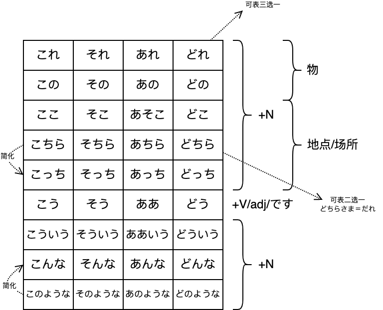

# N5

で

能看到原材料的

から不能看到原材料的

で动作发生的场所

に事物存在的/静态的场所/方向/目的地

は提示主题，用来表示后面，が用来表示前面

私はミクです指名字叫ミク的而不是叫其他的

私がミクです指这个人而不是其他人，体现的是我，动作的执行者是我

## こそあど

## 基数词

三何百千浊化

六八百圈促音

八千只变促音

万前再加上一

日期

日期1到10训读

20也是很特殊

还要注意479

量词

個/课/歳/冊在かさたは行

か行1 6 8 10变促进

さ行1 8 10变促进

は行

三何本杯匹浊化

1 6 8 10圈促

月/时注意4 7 9

分 1 3 4 何 6 8 10圈

1 6 8 10圈促

## 自动词/他动词

自动词  强调现象、状态

他动词  强调动作、行为，谁做的

自动词助词一般が

> 表经过的场所时，自动词前面用を
>
> 常见搭配　歩く、登る、渡る、通る、走る、散歩する、横切る(よこぎる)、曲がる(まがる)、泳ぐ(およぐ)、飛ぶ
>
> 特殊
>
> を踊る

他动词助词一般を

> を
>
> 把xxx怎么样
>
> 从A到B，经过C，经过的场所用を
>
> 表出发点，从小地方到大地方，出发点用を，大地方到小地方，着陆点用に

> 他动词一般结尾す，小部分え段＋る以及其他特殊
>
> 若え段＋る为自动词，则通常会存在结尾す的他动词

## て型た型

第一连用形：Vます型去掉ます

+N构成新的复合名词（食べ方 吃的方法）

+V/adj构成新的复合动词、复合形容词（食べやすい 容易吃的 食べ過ぎる 吃过头）

第二连用形：Vて

动作连续、并列、方式方法手段交通工具、原因

Vた

过去简体形、普通体、连体形

+N修饰名词

> 明日雨が降るか降らないかわかりません　降るか是降りますか的缩写，但是如果用了降りますか后面就是句号，用简体作为中间句

する

をする

做某事

運動をする 名词+を+する组成小句  運動する 前面接带有行为性质的名词，组合形成三类动词

> V原+つもりです 打算干什么　V原+つもりではない 不打算干什么
>
> Vない+つもりです 打算不干什么　Vない+つもりではない 不打算不干什么
>
> 朝ご飯を食べるつもりです 打算吃早饭
>
> しても尽管

表身上戴着的饰品，领带围巾戒指 通常以している出现

> Vて＋いる
>
> 正在进行、一直xxx、结果持续动作结果对现在产生影响（我有一辆车車をもている）

がする

五官的感受（花散发出很香的气味）

にする

人为把xx变成xx，决定、选择

やる

做，可与する互换但更随意

どうして　why

どうやって　how

できる

1. 新建好、新成立、产生（可表示具体也可表示虚拟关系建立）

2. 做好、完成
3. 可以、能够、会
4. 三类动词可能形
5. 长痘痘、身上长东西

> V原+ことができる 能做某事，与动词直接变可能形一致，相当于把动词变名词+ができる
>
> 読むことができますか　＝　読めますか
>
> N＋ができる
>
> 
>
> 可能形变成了一种状态，前面加が，当できる表可能或V可能形时
>
> 日本語を話す　→　日本語が話せる
>
> 話す他动词，变可能形无论是自动还是他动，都改が
>
> 
>
> Vた＋ことがある 曾经经历
>
> V原/Vない＋ことがある 时有发生
>
> 朝ご飯を食べたことがありますか　你曾经吃过早饭吗
>
> 朝ご飯を食べることがあります　我时不时吃早饭
>
> 朝ご飯を食べないことがあります　我时不时不吃早饭
>
> 
>
> よく/うまく＋できる做的很好

ある/いる

ある死的

具体或者抽象的有，事情的发生（事故があった）

> xxにxxがある  强调が前面的
>
> xxはxxにある  强调は后面的

いる活的

> ずっと外にいたので、体が冷えてしまいました
>
> ので客观，V简体/一类adj+ので，N/二类adj+なので
>
> から主观，可以简体から、ですから、ますから
>
> Vて＋しまう
>
> 表完结；非自愿发生，消极有些后悔（把钥匙忘了）

## 一类二类形容词

喜欢/不喜欢、擅长/不擅长、想要/不想要通常前面加が

A1/A2て形，表因为所以/不但而且，或者中顿

A1い→く/A2だ→に + 动词，类似xxx地，て形则是xxx的

> A1い→くなる自然而然变得怎样　い→くする人为施加作用使之变得怎样
>
> A2だ→に同理

A1て形　い→て（表因为所以/不但而且/中顿）

A1名词化　い→さ（表程度）　い→み　い→け　颜色去い

A1连体形　＋N　い→く＋V

いい按照よい来变形

天気がいいです→天気がよくなりました天气变好了

## 疑问词

いかがですか→いかがでしょか更委婉

なん用在た　だ　な行 / 数量词，其他情况用なに

有一些特例，比如なんか表之类、等等、什么的　なんか→など，なにか表什么东西；なんで为什么，なにで用什么

なぜなら 如果要问为什么

どうやって 怎么弄

なんで来なかったの 。やくそくしたのに

> くる→こなかった过去否定　ですか→の口语形式　のに明明...却...

## 助词

### が

が重心在前，は重心在后

> xxにxxがある  强调が前面的
>
> xxはxxにある  强调は后面的

が小主语，は大主语

>兄は背が高いです
>
>兄は，整个句子在说哥哥的情况
>
>背が，属于哥哥情况的一部分
>
>整体和局部的区别

擅不擅长(じょうず/へた)、喜不喜欢(好き)、想不想要(ほしい)

都用が

>ほしい只能用于第一第二人称，第三人称用欲しがる变动词，前面加を

其他固定句型

Vた/V原/Vない + ことがある/ことができる

### から

从xxx到xxx（xxxからxxxまで）表时空、主体的起点

xxxから 原因，表主观

> ので
>
> 原因，客观的事情（因为xxx，所以发生了一个事实），不是真的发自内心想要这样，不得已而为之

表原材料，最后的成品看不出原材料（酒由大米制作）

> で表原材料，成品能看到原材料（桌子由木头制作）

### で

动作进行的场所

方式方法手段交通工具原材料

数量合计

>5冊で三百円、一人で行く、全部で八人

表示范围

> この町で一番賑やかなのはこの辺です
>
> 在这个街范围内
>
> 一番賑やかな 连接形，最热闹的
>
> の代替那个东西、地方

表示原因、理由

### と

和、跟、同

> と一緒に，一緒に可省略

和对方约好的事情，双方共赴

> xxxに会う 单方面去见
>
> 此处に是单方面和对方进行某事
>
> xxxと会う 双方约定好的见面

引用

> と＋言う、思う、考える、書く

表假定 

必然/一xxx就xxx/做完后新发现

> 四大假定と、ば、たら、なら
>
> このボタンを押すと水が出る
>
> 只要按这个按钮水就会出来

### に

存在的地方

>xxにxxがある  强调が前面的
>
>xxはxxにある  强调は后面的

动作、作用着陆点

动作、作用的具体时间

> 有数字的时间、星期可加可不加
>
> 每上今明不加に
>
> いつ不加に　何時＋に

动作、作用的目的

> V变名词 + に + 来る/行く等方向性动词或普通动作，目的是做に前面那个名词
>
> 与N/A2に + なる/する差不多，に表目的，为了做に前面的东西

动作、作用涉及的对象

> 私は友達に電話をしました
>
> 电话这个动作指向了朋友

时间范围内的数量或次数

> 一日に3回

作为

表原因，因为xxx/由于xxx/对于

> あまりのおそろしさに、声もでなかった
>
> に可换成ので
>
> あまり没有跟否定，不表示不太，表过于
>
> 恐ろしい恐慌的 → 恐ろしさ恐慌 变名词

表同类事物的叠加，翻译成加上/和... 

> 类似と（列举全部），や...や...など（只列举部分）

### の

N+の+N 连接名词

> 不一定是 ...的 的意思
>
> 也可以代替省略掉的东西 その大きい荷物は私のです

A1/A2代替名词 A1＋の　A2＋なの

> この町で一番賑やかなのはこの辺です
>
> もうちょっと安いのを見せてください

N＋の... 修饰名词

> 田中さんの来る日　来る日整体可以看做一个名词，の跟着的可能是动词可能是名词
>
> 这句の类似が

形式体言

> 空を鳥が飛んでいるのが見えます
>
> 鸟飞过天空，把这个动作通过の名词化，这个动作不能单独作为主语和宾语

### へ

动作、作用的方向或目的地

> 比に更强调动作的方向，不一定真的到那个地方，但是に是能到的

动作、作用所涉及的对象，实际也是表方向

> これは田中さんへのプレゼントです
>
> へ表礼物的方向是田中
>
> 通常情况下に和へ可以互换，但上述表方向的东西去向，只能用へ

### まで

到... 表动作、作用的时间/场所终点

> 〜から〜まで 时空上的起点和终点

### を

动作涉及对象，接宾语，意 把xxx怎么样

> 接他动词

动作经过的场所

> 从A到B经过C，对C用を

动作的起点

> 小地方到大地方，出发点用を
>
> 降りる、卒業する、たつ也算

## 并列助词、提示助词

### と

并列

完全列举，数目不超过3个

### や

并列

部分列举

...や...や...(など)可省略

### か

2个或3个事物中选取一个，表选择

と、や表列举没有选择的意思，か表示从里面选

AかB A或B　AかBか 是A还是B

> 今日か明日　今天或者明天　か→あるいは可替换
>
> 明日雨が降るか降らないかはわかりません　不知道明天下不下雨
>
> 明日雨が降るかどうかはわかりません　同一个意思
>
> AかAないか　→　かどうか

### も

也、连、都

> 在肯定句中表全部肯定，否定句中表全部否定

数量词+も 表竟然 强调数量之多

### は

提示主题，重心在后

> 名词（+助词に、へ、で、と、から、まで）＋は

は大主语

表对比

> 山田さんは　テニスはしますが、ゴルフはしません
>
> 第一个は表示后面整个句子都在说山田的事情
>
> 后面两个は表示两者比较
>
> 小句句末が表转折，表但是，类似けど、けれど、しかし

は和が区别

は提示主题，重心在后；が重心在前

は大主语；が小主语

自动词前跟が；喜欢不喜欢，想要不想要，擅长不擅长用が

> 喜欢不喜欢(すき/きらい)、想要不想要(ほしい、xxxたい/ほしいくない)、擅长不擅长(じょうず、うまい、とくい/へた、にがて)
>
> 第三人称时，将い→がる，比如きらがる，将形容词变动词，故前面加を

### 〜しか〜ない

除此之外再无其他的意思

有说话人语气不满感觉常用于消极场合

### だけ

名词/V原/A1/A2+な＋だけ

只有 描述客观事实

### ～くらい/ぐらい

N+くらい/ぐらい

大约/大概/左右

### など

N+など

表等等 ...や...や...(など)可省略

> 一个句子中不能重复使用，不能用于人

## 连接助词、终助词

### が

句末表转折

> 类似けど、けれど、句号后しかし
>
> 私はよく旅行をしますが、お兄はあまりしません　我经常旅游，不过哥哥不太去
>
> あまり
>
> 1. +否定，表不太
>
> あまり好きではない
>
> 2. 数量+あまり，表 ...多、...余
>
> 百人余りの参加者がいる　有一百多人参加
>
> 3. N+の/V原/A2+な + あまり(に)，表 因为太过于...而...
>
> 4. あまりにも
>
> あまりに的强调，表非常，意思与とても相近，会带有太过分的意思，とても较为温和的非常
>
> とても有时候有どうしても的意思，表 怎么也 とてもできない　怎么也办不了

铺垫 后面有话要说但没说完

### ても/でも

即使、但是

> 口语中可以变成たって/だって

て形+も

尽管...也... 表示让步，前面的条件不会对后面的事情造成影响

> ても＋いいです　这么做也是允许的
>
> ても＋構いません  就算怎么怎么样也不介意，最好不要那么做但是做了也没事
>
> ない＋ても→なくても　否定
>
> 
>
> 学校を卒業しても、日本語の勉強を続けていくつもりだ　就算毕业了也打算继续学日语
>
> 学校を卒業 从学校毕业出来，小地方到大地方用を
>
> 続けていく て行く　坚持下去　行く表由近及远，继而
>
> V原/Vない＋つもりだ 打算、计划
>
> Vた＋つもりだ 就当做、就算是

疑问词＋でも＋肯定句 表全部肯定

> 疑问词＋も＋否定 表全部否定

> 尽管...也...
>
> 极端举例 先生でもできない
>
> 大致提示 お茶でも飲みましょうか　去喝点什么吧，比如说茶之类的，不一定是茶，随便举一个例子来说

### けれども/けど/けれど

与表转折的が类似，多用于口语

### しかし

与けど类似，前半句句号后，放在后半句

### 〜から/ので

表原因

句子简体/敬体+から

表主观，后面接愿望、推测、主张等

V原/Vない/Vた　/A1/A2+な　/名词+な　/句子简体形+ので

表客观，语气比から委婉，请求长辈、客观原因

### て/で

> 仅限A1/A2て形，名词+で

因为所以

不但而且

中顿

> Vて形
>
> 动作连续、动作并列、方式方法手段交通工具原材料、原因

### 〜ながら

一边...(次要)一边...(重点)

虽然...但是...

> つつ　同理
>
> つつある 表正在进行
>
> 类似Vている
>
> Vている表正处于什么状态，つつある表正在不断推进的含义

### それに

而且.../还有...  有递进关系

> それで
>
> 于是、因此、所以
>
> 催促对方继续往下说，然后（更郑重的是そしで，做了xxx之后，然后）
>
> そこで
>
> 因此
>
> したがって
>
> 表因此　前面句子结束后，したがって...
>
> ...にしたがって
>
> 服从，按照
>
> 随着...
>
> 表随着有四种
>
> 1. にしたがって
> 2. につれで
> 3. にともって
> 4. とともに
>
> 
>
> 東京は人が多いし、それに物価も高いので、すみにくいです　东京人很多物价又贵不适合居住
>
> し 列举原因，...又...
>
> V第一连用＋やすい　易于.../容易... 
>
> V第一连用＋にくい　难以...

### それとも

是...还是...？在两个疑问句中间

### それから

然后

> 类似そして，そして表的然后，前后关系更近，还有而且的意思，それから更远

### ところで

话说... 

用于转移话题，对话开头或中途停顿后的开头

> ところが
>
> 放句首 可是、不过
>
> 〜どころか
>
> 否定前项，并提出程度更深的后项
>
> 最近はたぼうで、旅行どころが、コンサートに行く暇もない　别说去旅游了，就连去音乐会的功夫都没有
>
> ～どころではない
>
> 不是xxx的时候
>
> 今はそれどころではなく、仕事におわれる毎日だ　现在哪有那个功夫，每天都被工作所迫
>
> そういえば
>
> 与ところで相近，但是想起的是相关的话题

### それで

于是、因此、所以，表上下文因果关系

催促对方继续往下说，然后

## 接尾词/副词

### 时间＋すぎ/まえ

接在时间之后，表这个时间之后/之前

### 〜たち/がた

...们

がた更尊敬，只能用在第二三人称后

### 〜中(ちゅう/じゅう)

存在A-B段

若只是AB段之中的一小部分就是ちゅう，是AB段的整一段就是じゅう

世界中（せかいじゅう）全世界

### ～にん/じん/ひと

にん前面多接数词，じん前面多接国家地名，ひと单独使用

### 〜ずつ

每... / 一点点地...

等比例分发、以相同数量或程度反复

> ごと
>
> 每
>
> 電車は5分ごとに出る 电车每五分钟一趟
>
> おき
>
> 隔着，每隔
>
> 三メートル置きにきを植える  每隔三米种一棵树

### とても

后面接肯定表达，意为 非常...

后面接否定表达，意为 怎么也... /无论如何也...

### あまり

后面接肯定表达，意为 非常...

> あまり美味しかったので、つい食べすぎてしまった  因为太好吃了，所以不小心就吃多了
>
> つい
>
> 1. 最终
>
> 2. 无意之间

后面接否定表达，意为 不怎么... /不太...

数词+あまり　表...余 /...多

> 百人あまり  一百多人

> 〜あまり(に)
>
> V原/A2+な/名+の　＋　あまり(に)
>
> 由于过度...因而...
>
> 表由于程度过甚导致了某种结果

### 少し

稍微/暂时/不愿/一点 表程度轻

> すこない　少的 一类形容词 不是否定意思

### ぜんぜん

完全不.../根本不...

后接否定表完全否定

> 政治については全然きょうみがない　对政治完全没有兴趣
>
> について 对于
>
> 趣味/興味 常用法
>
> しゅみは...
>
> きょうみがない/ある

### ほとんど

大体上、差不多、差一点、几乎

> 昨日は忙しくて、殆ど眠れなかった　昨天太忙了几乎没睡觉
>
> 忙しい→忙しくて 变て形表因为太忙了
>
> ねむる→眠れる→眠れない
>
> 寝る只表示上床躺着，不一定睡觉
>
> 眠る表示大脑关机的睡觉

### いつも

总是、经常、平时 表一般的状态或习惯

> このレストランはいつもたくさん人が並んでいますね
>
> ならぶ　自 排队
>
> ならべる　他 摆放

### やっと

终于

经过漫长努力和时间终于做成什么，常用过去式，表解脱的喜悦

> V去ます+つづける　表持续

### ぜひ

务必、一定

> こちらにいらしゃるきかいがあったら、ぜひおよりください　有机会到这里来的话请一定要过来
>
> いる、行く、来る→いらしゃる　尊他
>
> ある→あった＋ら→あったら  如果有的话
>
> 寄る　寄信，靠近的  年寄り
>
> 寄る→寄ります→お寄りください　来る的尊他

### そろそろ

差不多该...

> そろそろ失礼いたします
>
> する→いたす→いたします→申し上げます
>
> いたします是します的自谦
>
> 申し上げます还是します的自谦，比いたします更客气
>
> 申し上げます、申します都是言う的自谦，申し上げます涉及对象，申します不涉及对象
>
> します的尊他是なさるー＞なさいます

## 常用表达方式

### 〜ください

名词+をください

请给我某物

Vて＋ください　请为我做某事

Vない＋でください　请不要...

> 高いですね、もっと安くしてください
>
> 安い是adj，不能直接变て形+ください，要变成动词，故+する，变成安くする动词，表人为使xxx变得怎么样，然后变て形再加ください
>
> 
>
> 大きな声で話さないでください
>
> 大きい / 小さい 比较特殊可以按照一类形容词直接+N，也可以按照二类形容词去掉い+な+N
>
> で表方式方法手段
>
> 話す→話さない　变否定

〜Vて+くださいませんか / Vない+でくださいませんか

能否请您...

### 〜ませんか/～ましょうか

委婉劝诱、建议

意志形→ましょう→ましょうか→ませんか　逐渐委婉

ましょうか表疑问时，比ますか委婉

ましょう可用于说话人主动提起某事

> 私の傘をお貸ししましょう　我把伞借给你吧
>
> 貸(か)す 借出去  借(か)りる 借进来
>
> かす→かします→去掉ます，前加お，后加します，变成自谦→おかしします
>
> 自谦
>
> お、ご(音读)＋第一连用形＋します
>
> 
>
> 私は王さんにカメラを貸しました  我借给小王照相机
>
> ...てもらう得到别人为我做某事
>
> 私は王さんにカメラを貸してもらいました
>
> もらう动作比貸す先，变成了我得到别人为我做某事，做的事情是貸す，所以这句话是我得到小王为我借出的动作，即小王借我相机
>
> 私は王さんにカメラを借りてもらいました
>
> 我得到小王，为我从别人那借进来的动作，即我让小王借我相机
>
> 貸してもらう　借进　借りてもらう　借出
>
> 和原本意思正好相反

### 〜たい

V第一连用+たい

想做某事，表第一人称的愿望

> 〜たがる 第三人称的想做某事

〜たいですか可用于第二三人称，不能对上司长辈

### ～がほしい

想要得到某物  第一人称

> 第三人称用 〜をほしがる　变成了动词
>
> Vてほしい　想要得到别人为我做某事
>
> 等价于Vてもらいたい

和〜たいですか类似，可疑问用于二三人称

### 〜だろう/でしょう

V简体形+(の) / A1 / A2 / N＋だろう / でしょう

应该...吧？

和确信程度不高的たぶん、おそらく等连用，表说话人的主观推测；和かならず、きっと等确信度较高的连用，表说话人较为肯定的判断

でしょう是だろう的礼貌用法

### 〜にする/～になる

A1→く＋する

A2 / N＋にする

+する 人为使之变化  +にする还可表示选择

> 母の誕生日のプレゼントはセーターにしました　就选毛衣当妈妈的生日礼物了

+なる 自然而然的变化  +になる还表示客观导致的

> 今度国に帰ることになりました　这次决定回国

### ~ている/〜てある

> 和单纯的いる/ある不一样

~て形+いる

1. 正在做

2. 一直在做

3. 之前动作的结果对现在还有影响

> ...着  戴着眼镜 

〜が/は＋他动词て形＋ある

> 他动词て形＋ある变成了类似自动词，所以前面加が，而不是他动词前+を

完成某项动作后形成某种状态，结果状态仍然保留，类似现在完成时过去完成时

### もう〜

1. 已经...了  后接动词た形，表动作做完

2. 已经(不)... / 再也(不)...  接否定  一般现在时

3. もう＋数量词/副词  再、另外  原来的基础上再增加一些数量/程度

### まだ〜

还... 接肯定，表动作到现在还持续着

> まだ...ている　仍然...着

还(未)... / 还(没有)...  接否定  表动作还没有发生，接下来要做 / 动作还没有结束，接下来要结束

动词是持续性动词，一般用まだ〜ていない

> パーティーはまだ始まりません　排队还没有开始　到该开始的时间点还没有开始
>
> 本はまだ返していません　书还没有还　到该还的时间点还没有还，又往后拖了一段时间
>
> 8点钟就到车站了，结果车9点还没来，就是ていません
>
> 9点钟到了这个站，看到车没有来，就是ません

まだまだ

1. 仍然还是
2. 尚未还没

### 〜ほうが〜

Vた/ない / A1 / A2+な / N＋の　＋　ほうが〜

> 将ほう当作N，所以前面的连用和名词前连用相同

还是...比较...

ほうがいい　还是这样比较好

### 〜前に/～あとで

前に

V原 / N＋の　＋　前に

后项是过去式，前项也必须是V原而不是Vた

>〜に先立って/に先立ち（さきだち）与之类似
>
>在...之前 / 先于...
>
>映画の一般公開に先立ち　在电影公映之前

後で

Vた/ N＋の　＋　後で

> 後で前后两个动作之间间隔可长可短，てから则前后两个动作时间间隔很短

### ～時

V普通形 / A1 / A2+な / N+の　＋　とき

在...的时候

V原＋とき时，后面句子的动作是とき之前或同时进行的

> 東京へ行く時、飛行機に乗りました　去东京时做了飞机  坐飞机是在去东京之前发生的

Vた＋とき时，后面句子的动作是とき之后进行的

> 東京へ行った時、海の写真を撮りました　去东京时拍了大海的照片  拍照片是去了东京之后发生的

V原＋時 V2 先做V2再做V1 / 同时进行

Vた＋時 V2 先做V1再做V2

### 〜てから

前一项动作发生接着出现后项动作

> 毎日お風呂に入ってから寝ます　每天都洗完澡后再上床睡觉

### 〜ほかに(は)

名词＋の＋ほかに(は)

除了...以外

### 〜と〜とどちらが〜か

...和...哪个...   二选一

バスと電車とどちらがいいですか

> どれ多选　どちら二选一

### 〜で〜が一番〜

在...内...是最...的

日本(の中)で富士山が一番有名な山です

表限定范围内的最高级

# N4

## 助动词

### 〜ず(に)

ず(に)=ない(で)

Vない形怎么接ない就怎么接ずに，～する→〜せずに（勉強しない→勉強せずに）

> Vない直接＋で
>
> 表在不做前项的前提下做后项，＋ください表请不要怎么样
>
> 理论上Vない＋て按照A1+て是Vなくて，但就变成了一类形容词的て形变化，表不但而且、因为所以、不是而是的意思了

### 〜たがる

Vたい＋がる→Vたがる

表第三人称的想要做某事，Vたい是第一人称

> このアパートに住みたがっている学生が多い　有很多学生想要住进这个公寓
>
> 住みたがっている　一直这么想要住进去  第一人称たい→第三人称たがる→加ている变たがっている

### ～がる

A1 / A2 词干＋がる

表第三人称的感觉感受

将形容词动词化变成一类动词，故否定是〜がらない

> 寂しい→寂しがる
>
> 急に大きな音がしたので、その子供は怖がって泣いてしまった　突然发出很大的声响，那个孩子害怕地哭了
>
> する变た形→した  怖い→怖がる→怖がって　变て表因为  
>
> てしまった  非自愿发生...事 / 完结

### 〜そうだ

简体小句(动词普通形 / A1 / A2 / N+だ)＋そうだ　表传闻

> 过去和否定要在前面变形，常和～によると、によれば、の話では使用

A1 / A2 词干＋そうだ　表样态(看上去怎么怎么样)

> 不能接视觉上的直观评价，如きれい
>
> いい→良さそうだ　ない→なさそうだ

V第一连用形＋そうだ

> 美味しそうだ　看起来很好吃

1. 瞬间性的词，眼看就要怎么样，表样态
2. 可能会怎么样，表推测

### ～ようだ

V连体 / A1连体 / A2连体 / N连体＋ようだ

像...一样，表比喻

> 彼女の笑顔は太陽のように明るく輝いている　
>
> ように＋V　ような＋N
>
> よう就是N，ように就类似Nに＋する/なる　就是xxx地xxx

像...那样，表举例

好像... 似乎...，表主观推测，带有不确定性的语气

> あの時はしかたなかったのだが、彼を怒らせるようなことを言ってしまって悪かったと思った
>
> 那时候是没有办法，不过似乎说了使他生气的话，所以觉得很不好意思
>
> する→します去ます→しかた　做...方法方式
>
> ない过去→なかった　のです→のだ强调原因 　が表转折
>
> 怒らせる  使役，让他发怒　ような那种样子的
>
> と思った，表我认为悪かった

### 〜らしい

V原 / A1 / A2词干 / N / た形＋らしい

好像...，表根据客观情况、传闻推测出可能性很高的推测，间接、转了好多手的消息

> 常与どうも / どうやら搭配

N+らしい

像...似的、地道的...，表主体具有らしい前的典型性

日本人像长沙人一样嚼槟榔说长沙话

> 日本語らしい日本語をみにつけたい
>
> つけたい想要附着  みにつけたい想要附着在身上  日本語らしい日本語 像日语一样的日语即地道的日语

### 〜みたいだ

V原 / A1 / A2词干 / N / た形＋みたいだ

好像...，表主观判断

像...，表比喻

> 常与まるで搭配

像...那样，表列举

> 表推断时，是说话人自己亲身经历体验到，如看到了听到了闻到了。如果是从其他人那间接听到用らしい，如果将内容原封不动报告用そうだ
>
> 山下さんは今日は来ないみたいですね　看到时间太晚了推断不来了
>
> 山下さんは今日は来ないらしいですよ　不是直接听他讲的，而是别人这么说的
>
> 山下さんは今日は来ないそうです　山下留言说不来了

## 补助动词、形式体言、接续助词

### 〜ておく/とく

Vて＋置く　てお→と　多用于口语

事先...

> お客さんが来るからテーブルの上にお皿に並べておきます　有客人要来，先在桌子上摆好盘子

### ～ていく/～てくる

Vて＋いく

由近及远

继而后去

Vて＋くる

由远及近

继而后来

> てきた　现在这个点是由过去来的

### 〜てしまう/ちゃう

Vて＋しまう　てしま→ちゃ　でしま→じゃ　多用于口语

完了，带有懊悔语气

非自愿发生

> 忘れる→忘れてしまう→忘れてしまった→忘れちゃった

单纯しまう仅仅表完结，不附带语气

### 〜てみる

Vて＋みる

试着...看　

表尝试做某事

> 私はできませんが息子にやらせてみましょう　我虽然不能做，请让我儿子做做看
>
> やる→やらせる→やらせてみる　使役，试着让他干

### 〜もの

连体形＋もの

形式体言，代替要说的东西

### 〜こと

连体形＋こと

形式体言

> ことがある
>
> Vた＋ことがある  曾经经历
>
> V原 / Vない＋ことがある  时有发生
>
> ことができる  可以、能够、会
>
> ことにする
>
> 内部主观因素的决定
>
> ことになる
>
> 外部客观因素的决定

大部分时候可以和形式体言〜の互换，但是充当句子谓语时只能用こと，即AはBです

> 私の趣味は切手を集めることです　我的兴趣爱好是集邮
>
> 如果改成のです，就是知道结果问原因，收集邮票是动作，无法直接+です
>
> こと 这么回事  の 是这样子的

### 〜ということ

句子普通形(去ます/です)＋と言うこと

...的是...

こと的加强版，归纳较长的句子

### ～の/んです

V简 / A1 / A2＋な / N＋な　＋　の/んです

(原因)是... ，表说明、强调

知果说因。疑问句中表说话人要求对方做出某些说明，打破砂锅问到底

～の/んです用于句末，表强调说明或者说话者的主张，んです多用于口语，表达更加委婉

### ～のに

V简 / A1 / A2＋な / N＋な　＋　のに

逆接，明明...却...

表结果与预想不同，有些遗憾

## 许可、禁止和接尾词

### てもいい

Vて＋もいい

可以...

表许可，常用～てもいいですか表请求许可　〜てもよろしい更礼貌　〜なくてもいい表前项行为动作不发生也可以

### てもかまわない

Vて / A1て＋も構わない

...也行，...也可以

表容忍

> ても相当于两个防线的表层防线触碰了也没事，ては只有一个防线，不可触碰

### てはいけない

Vて＋はいけない

不可以...，不能...

表禁止，上对下，语气强烈

### なければ ならない / いけない

Vない / A1く / A2＋で / N＋で　＋　なければ ならない / なければいけない

> 相当于A2变未然→ではない→变可能→ではなければ→去掉は→でなければ

必须...，不...不行，非...不可，双重否定表肯定，不这样做不行

口语中，なければ→なきゃ　なくては→なくちゃ，口语中也会省略ならない/いけない

> なくてはならない/いけない　与なければならない类似，但是包含了不这么做走投无路要死的感觉，程度重

### なくてもいい

Vない / A1く / A2＋で / N＋で　＋　なくてもいい

不...也行

不必勉强做某事，类似なくても構わない

### ～なくては ならない / いけない

Vない / A1く / A2＋で / N＋で　＋　なくては ならない / いけない

必须...

口语中なくては→なくちゃ

### 〜すぎる

V第一连用形 / A1词干 / A2词干　＋　過ぎる

过于...，表某种行为过度

すぎる活用与动词一致，常用来变ます然后去ます名词化，如飲み過ぎ、言い過ぎ、食い過ぎ

### 〜だす

> 他动词 だす 把东西弄出来
>
> 自动词 でる 表出现出门

...起来了，突然出现了什么东西

还有...出来的意思，如探し出す、飛び出す、照らし出す

### 〜つづける

持续

V第一连用+つづける

表动作或状态的持续

### 〜やすい / 〜にくい

やすい

容易...，易于...，表容易做

やすい与にくい互为反义词，表某事物在性质上容易有那样的倾向，A1活用

にくい

难以...，不容易...，表客观难做

多从事物或事情本身性质而言不好做，如燃えにくい、書きにくい、食べにくい，A1活用

### ～かた

V第一连用形＋方

...的方法

表某种方法，通常固定搭配，如書き方、使い方、話し方

### 〜さ

A1词干 / A2词干　＋　さ

...度，...之大，表性质和状态的程度

形容词词干+さ，可构成表程度的名词

## 时间和举例

### 〜うちに

V简 / A1 / A2+な / N+の　＋　うちに

在...的时候，趁着...，...着...着就...(歌听着听着就会唱了)

> どうぞ、温かいうちにお召し上がりください　请趁热吃吧
>
> 食べる　尊他→召し上がる→召し上がります→お召し上がりください

> そのうちに来るでしょう　不一会儿就会来
>
> そのうちに  不一会儿 / 要不了多久

### 〜ところ / 〜ているところだ / 〜たところだ

〜ところ

V原　＋　ところ

正要...，正打算...

表正处于动作刚要发生还没发生的阶段

常与ちょうど、今、これから等副词搭配

> これから食事に行くところなんですが、一緒にいかがですか　我正打算去吃饭，要一起来吗
>
> なんですが　前面ところ是N，组成N＋な＋のです知果说因
>
> いかが 如何

〜ているところだ

Vている　＋　ところだ

正在...

表动作正在进行

～たところだ

Vた　＋　ところだ

刚刚...

表动作或变化刚刚结束，与现在时间点间隔很短

常与 今、さっき、ちょっと前 等副词搭配

### 〜ばかり

〜ばかり

V原 / N＋ばかり

只...，光是...

表除此之外没有别的，多个相同的事物或多次重复同样的行为

表示 只... 的时候与～だけ / 〜しか〜ない类似，表达多次重复的时候不能替换

〜てばかり

Vて　＋　ばかり

总是...，只...，一个劲地...

表状态或行为总是反复出现，说话人对此感到不满

> テレビをみてばかりいると、目が悪くなりますよ
>
> ている→てばかりいる  一个劲地在做  ばかり插入到ている中间，表长期一直在做
>
> と如果这样子做

〜たばかり

Vた　＋　ばかり

刚...

表刚刚做完每个动作

～たところだ只能用于眼前刚刚做完的事情，〜たばかり对时间并无限制，主观觉得短就能用

### 〜までに

V原 / N　＋　までに

到...为止，在...之前

> まで是在时间截止之前一直在做；までに是在时间截止之前，某个时间点做一次
>
> 8.15前交论文，までに，8.15前某个日子交论文，做一次
>
> 8.15前在这里呆着写论文，まで，8.15前一直写

### ～でも

N　＋　でも

...之类的

大致提示

> 一緒にコーヒーでもいかがですか  要不要一起喝杯咖啡
>
> 随便举出一个

### 〜とか

V原 / N　＋　とか

...之类的，表列举

AとかBとか

列举出典型的例子，还有其他，类似〜や〜や〜など

> 小句＋とか，类似そうだ表传闻，听说

> 時には散歩するとか運動するとかしたほうが体にいいですよ　偶尔散散步做做运动什么的对身体有好处哦
>
> 可以和たり替换　散歩したり運動したりしたほうが

### 疑问词＋か

表不确定，常用いつか　どこか　誰か　何か

### 疑问词＋も

出现在否定句中表全盘否定

疑问词＋でも　表全肯

### 〜または

或者

表两者之间随便哪个都可以

### 〜たり / 〜たり〜たり

Vた / Nた / A1た / A2た　＋　り　最后一定要有する

有时...有时...

列举两个或以上动作，若前后意思对立则表示动作反复进行

〜たり(など)する，只列举一个

> 休みの日は映画を見たりしています　休息的时候看看电影什么的

### 〜し / 〜し〜し

V简体 / A1 / A2简体 / N简体　＋　し

又...又...

列举

> 初めは言葉もわからないし、友達もいないし、本当に大変でした
>
> いる→いない　ある→ない

## 比较程度推测打算

### 〜ほど〜ない

N＋ほど〜ない

没有...那么...，不如...  后接否定表比较的基准

表示比较双方有着共同属性，但是存在差异，ほど前的内容表示比较的基准

> 私はミクほど綺麗ない  我没有miku漂亮

### 〜より

V简体 / N　＋　より

...比...，两者比较

より前为比较基准，重点为后面的

### 〜まま

Vた / Vない / A1 / A2＋な / N＋の　＋　まま

维持原状

> わがまま　任性　我が儘 即我是维持原样→任性

### 〜のうち

在...之中

与～の中意思相近

> 裏　背面
>
> うち　里面
>
> なか　中间

### 必ず

一定，务必

> 必死　ひっし　表拼命
>
> 必ずしも接否定，表未必
>
> 
>
> ぜひ　请求　常和てください / てほしい连用
>
> きっと　主观推测　彼女はきっと忙しいだろう　常和だろう / でしょう / に違いない连用
>
> 必ず　务必

### 〜かもしれない

V简体 / A1 / A2词干 / N　＋　かもしれない

> も也，し知，れ可，ない不　→　也未可知　→　也许
>
> 平时这么接か同理，怎么接です就怎么接か

也许...，可能...

表说话人可能性较低的推测，常与もしかして(也许) / もしかすると(或许) 连用

### 〜つもりだ

V原 / Vない 　＋　つもりだ

打算...

可用于第一和第三人称

### 〜たつもりで

Vた　＋　cうもりで

就算是...，当作...一样

当作这样，但实际上没这样，虚拟语气

### 〜はずだ / 〜はずがない

〜はずだ

V简体 / A1 / A2＋な / N＋の　＋　はずだ

理应...，应该...

表说话人根据事物一般常理或发展趋势的推断、预测

〜はずがない

V简体 / A1 / A2＋な / N＋の　＋　はずがない

不可能...，不会...

表说话人推测不会发生

〜はず 表说话人根据某些依据做出的推测，但没有十足把握，不可用在自己的主观意志可以决定的事情上(手上的鸟是死是活，没有依据全凭主观决定生死)

## 条件、目的和限定

| と                                                     | ば                                                           | たら                                         | なら                     |
| :----------------------------------------------------- | :----------------------------------------------------------- | :------------------------------------------- | ------------------------ |
| 必然条件（普遍情况，反复动作） 一...就...，强调后句 | 必然条件 强调前句                                         | 偶然条件（偶然事件，个别情况） 多用过去式 |                          |
|                                                        | 假定条件 强调因                                           | 假定条件 强调果                           |                          |
|                                                        | 反实条件 书面化                                           | 反实条件 口语化                           | 反实条件 情绪化       |
| 不能加意志表达（愿望、请求、明令、忠告、建议）         | 跟意志表达，必须加状态词（ある、いる、要る、可能形、形容词） | 可以加意志表达                               | 强烈的主观意志           |
|                                                        |                                                              |                                              | 提示主题，相当于は       |
|                                                        |                                                              |                                              | 结果なら，原因           |
|                                                        |                                                              | 相当于ては、てから，表先后顺序               |                          |
|                                                        | ...も...ば...も；さえ...ば；...ば...のに；...ば...ほど       | ...たら最後                                  | ...も...なら；...も...だ |

と  ば  たら  なら 越来越主观

### と

V / A1 / A2 / N 简体　＋　と

一...就...

### ば

V / N / A1 / A2 假定形

Vば / A1＋ければ

A2 / N＋であれば

> です→である→であれば→简化→ならば→なら

如果...就...

> 温度をれい度以上にすれば、氷が水となる　温度升至零度以上的话，冰就会变成水
>
> 如果用と重心在后，就是冰一定会变成水不会变成其他的东西
>
> 用ば重心在前，就是零度以上才会变，零度以下不会变

### たら

V / A1 / A2 / N 过去式＋ら

万一...就...

### なら

V / A1 简体＋(の/ん) 　＋　なら

 A2词干 / N　＋なら

> 怎么加です就怎么加なら

要是...就...

描述结果+なら，然后再说原因，前面几个只能说原因再说结果

### もし

もし＋句子

如果...

多用于句首，后面接表假设的句子，常与たら、なら、ば连用

### もし〜ても

就算...

表 就算某种情况成立，也...，虽然不太会出现，但是...

### 〜といい

V / A1 / A2 / N 简体　＋　といい

...的话就好了

用于表达现实情况与预期不符，或表说话人愿望。常与が(但是)、けど(转折)、のに(明明...却...)等表转折的搭配

### 〜ため(に)

>為→因为，为了

V简 / A1 / A2＋な / N＋の　＋　ため(に)

> A2＋な / N＋の说明ため是名词，按照名词法连接

因为

表客观原因，后项大多是消极结果，不能接意志性(推测、命令、劝诱)的内容

N＋の / V原　＋　ために

为了

表目的情况下，前后两句主语要一致

### 〜よう(に)

V原 / Vない / V可能　＋　よう(に)

为了...，表目的

表将某种状态作为目标并朝着它努力，よう(に)前要用非意志性动词，如できる、わかる、見える、聞こえる，前后主语可以一致可以不一致

### 〜ようになる

V原 / Vない / V可能　＋　ようになる

变得...，逐渐会...

从一个状态变到另一个状态

### 〜ようにする

V原 / Vない　＋　ようになる

要做到...

人为努力要做到，努力不做到

### 意志形＋とする

打算...，想要...

为实现什么而努力或尝试

### ではなく

不是...而是...

否定前项，肯定后项，口语中常用じゃなく

### 〜かわりに

> 变换代替，四个文字全都是かわる中的か
>
> かわる→かわります→かわり  名词化

V原 / A1 / A2＋な / N＋の　＋　代わりに

代替...

代替某人做某事、代替某物、不做某事而做另外一件事

表示作为交换，その代わりに可用作接续词

虽然...但是...

表转折，表事务有积极和消极的一面，相互关联

### ちっとも〜ない

一点也不...

表完全否定

### おもに

主要

表大部分的情况

## 决定、依据和感受

### 〜ないで

> 类似ずに

Vない＋で

用来加ください

> Vない形加 下さい 需要加上 で

单纯不做前项的时候做后项

表并列对比动作，不做A而做B，不做前项的时候做后项

### 〜なくて

Vない→ない→なく＋て→なくて

A1 →くない→くなく＋て→くなくて

A2 / N　＋ではない→ではなくて→でなくて

不A而B

表并列，前项否定

> 本质就是て的变化，按照て含义

### 〜によると/によれば

传闻、来源

> 天気予報によると今夜は雪が降るそうです

常与～そうだ、〜らしい、〜だろう(好像、大概)等表推测的句型搭配使用

### 〜がする

N　＋　がする

感觉到...

接在表味觉触觉嗅觉听觉等名词后，表某种感觉

### 〜か〜ないか

是A还是不B

在做不做一件事上犹豫

> 〜か〜か　是A还是B
>
> 〜かどうか　是否

### 〜かどうか

V简 / A1 / A2 / N　＋　かどうか

是否

### 〜だい/かい

ですか的随意表达方式

### 〜ことがある

Vた　＋　ことがある

曾经经历

否定是ことがない，表曾经没有经历过，如果变成了 ないことがある 就变成了时不时不发生

V原 / Vない　＋　ことがある

时有发生

### 〜ことができる

V原　＋　ことができる

> 类似AはBができる
>
> こと这个事情が＋できる

可以能够会

> 料理を作る
>
> 料理を作れる　能够做料理
>
> 料理を作ることができる　能够做料理

否定ことができない

### 〜と言う

N 　＋　と言う

叫做...

对定义或某事物解释说明

说...

引用第三人称的话

### ～意志形と思う

V意志　＋　と思う

表说话人的打算或计划

と思う

表第一人称

と思っている

表我早就这么想了或第三人称

## 授受关系

我  你  他

### 授

#### あげる

Aは　Bに　Cを　あげる

A可以是我你他

B一定不能是我，此外都行

あげる→自谦さしあげる　对上级

あげる→やる　对下级

#### くれる

填补あげる的bug

Aは　Bに　Cを　くれる

A可以是我你他

B一定是我

くれる→尊他くださる　考虑到长辈给我，所以存在尊他，不存在自谦

### 受

#### もらう

Aは　Bに　Cを　もらう

もらう→自谦いただく

A和B可以是我你他

授　に表对象，着落点

受　に表从的意思，から

看は前面是长辈还是晚辈，谁在做，来确定尊他自谦

Vて＋あげる/くれる/らう　C则不是某物而是动作

### 借りる / 貸す

私は先生に本を　借りる

は前面是我，从先生那借入，最后书在我这里

私は先生に本を　貸す

は前面是我，从我这借出，最后书在先生那

私は先生に本を　借りてもらう

てもらう表我得到老师为我做的动作，动作是借入，我得到老师的借入动作，所以书最后在老师这里

我从老师处借入书

私は先生に本を　貸してもらう

てもらう表我得到老师为我做的动作，动作是借出，我得到老师的借出动作，所以书最后在我这里

我借出到老师处

私は先生に本を　借りてあげる

てあげる表我为老师做了一个动作，动作是借出，我为老师做借出动作，书最后还是在老师那，货物转移方向没有变化

私は先生に本を　見せる

見せる使役，我让老师看书

私は先生に本を　見せてあげる

我为老师做一个让看的动作，还是我让老师看书

私は先生に本を　見せてもらう

我得到老师为我做一个让看的动作，所以是老师让我看书

もらう会让关系反转
