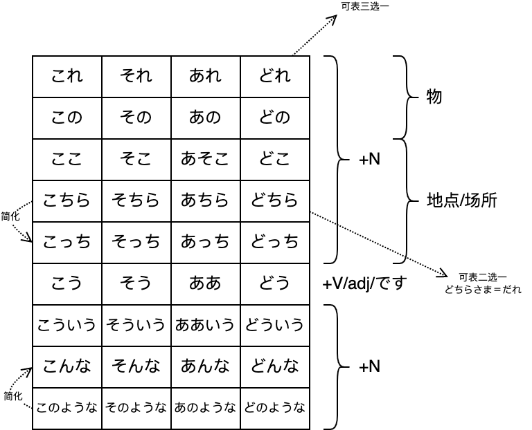

# N5

で

能看到原材料的

から不能看到原材料的

で动作发生的场所

に事物存在的/静态的场所/方向/目的地

は提示主题，用来表示后面，が用来表示前面

私はミクです指名字叫ミク的而不是叫其他的

私がミクです指这个人而不是其他人，体现的是我，动作的执行者是我

## こそあど

## 基数词

三何百千浊化

六八百圈促音

八千只变促音

万前再加上一

日期

日期1到10训读

20也是很特殊

还要注意479

量词

個/课/歳/冊在かさたは行

か行1 6 8 10变促进

さ行1 8 10变促进

は行

三何本杯匹浊化

1 6 8 10圈促

月/时注意4 7 9

分 1 3 4 何 6 8 10圈

1 6 8 10圈促

## 自动词/他动词

自动词  强调现象、状态

他动词  强调动作、行为，谁做的

自动词助词一般が

> 表经过的场所时，自动词前面用を
>
> 常见搭配　歩く、登る、渡る、通る、走る、散歩する、横切る(よこぎる)、曲がる(まがる)、泳ぐ(およぐ)、飛ぶ
>
> 特殊
>
> を踊る

他动词助词一般を

> を
>
> 把xxx怎么样
>
> 从A到B，经过C，经过的场所用を
>
> 表出发点，从小地方到大地方，出发点用を，大地方到小地方，着陆点用に

> 他动词一般结尾す，小部分え段＋る以及其他特殊
>
> 若え段＋る为自动词，则通常会存在结尾す的他动词

## て型た型

第一连用形：Vます型去掉ます

+N构成新的复合名词（食べ方 吃的方法）

+V/adj构成新的复合动词、复合形容词（食べやすい 容易吃的 食べ過ぎる 吃过头）

第二连用形：Vて

动作连续、并列、方式方法手段交通工具、原因

Vた

过去简体形、普通体、连体形

+N修饰名词

> 明日雨が降るか降らないかわかりません　降るか是降りますか的缩写，但是如果用了降りますか后面就是句号，用简体作为中间句

する

をする

做某事

運動をする 名词+を+する组成小句  運動する 前面接带有行为性质的名词，组合形成三类动词

> V原+つもりです 打算干什么　V原+つもりではない 不打算干什么
>
> Vない+つもりです 打算不干什么　Vない+つもりではない 不打算不干什么
>
> 朝ご飯を食べるつもりです 打算吃早饭
>
> しても尽管

表身上戴着的饰品，领带围巾戒指 通常以している出现

> Vて＋いる
>
> 正在进行、一直xxx、结果持续动作结果对现在产生影响（我有一辆车車をもている）

がする

五官的感受（花散发出很香的气味）

にする

人为把xx变成xx，决定、选择

やる

做，可与する互换但更随意

どうして　why

どうやって　how

できる

1. 新建好、新成立、产生（可表示具体也可表示虚拟关系建立）

2. 做好、完成
3. 可以、能够、会
4. 三类动词可能形
5. 长痘痘、身上长东西

> V原+ことができる 能做某事，与动词直接变可能形一致，相当于把动词变名词+ができる
>
> 読むことができますか　＝　読めますか
>
> N＋ができる
>
> 
>
> 可能形变成了一种状态，前面加が，当できる表可能或V可能形时
>
> 日本語を話す　→　日本語が話せる
>
> 話す他动词，变可能形无论是自动还是他动，都改が
>
> 
>
> Vた＋ことがある 曾经经历
>
> V原/Vない＋ことがある 时有发生
>
> 朝ご飯を食べたことがありますか　你曾经吃过早饭吗
>
> 朝ご飯を食べることがあります　我时不时吃早饭
>
> 朝ご飯を食べないことがあります　我时不时不吃早饭
>
> 
>
> よく/うまく＋できる做的很好

ある/いる

ある死的

具体或者抽象的有，事情的发生（事故があった）

> xxにxxがある  强调が前面的
>
> xxはxxにある  强调は后面的

いる活的

> ずっと外にいたので、体が冷えてしまいました
>
> ので客观，V简体/一类adj+ので，N/二类adj+なので
>
> から主观，可以简体から、ですから、ますから
>
> Vて＋しまう
>
> 表完结；非自愿发生，消极有些后悔（把钥匙忘了）

## 一类二类形容词

喜欢/不喜欢、擅长/不擅长、想要/不想要通常前面加が

A1/A2て形，表因为所以/不但而且，或者中顿

A1い→く/A2だ→に + 动词，类似xxx地，て形则是xxx的

> A1い→くなる自然而然变得怎样　い→くする人为施加作用使之变得怎样
>
> A2だ→に同理

A1て形　い→て（表因为所以/不但而且/中顿）

A1名词化　い→さ（表程度）　い→み　い→け　颜色去い

A1连体形　＋N　い→く＋V

いい按照よい来变形

天気がいいです→天気がよくなりました天气变好了

## 疑问词

いかがですか→いかがでしょか更委婉

なん用在た　だ　な行 / 数量词，其他情况用なに

有一些特例，比如なんか表之类、等等、什么的　なんか→など，なにか表什么东西；なんで为什么，なにで用什么

なぜなら 如果要问为什么

どうやって 怎么弄

なんで来なかったの 。やくそくしたのに

> くる→こなかった过去否定　ですか→の口语形式　のに明明...却...

## 助词

### が

が重心在前，は重心在后

> xxにxxがある  强调が前面的
>
> xxはxxにある  强调は后面的

が小主语，は大主语

>兄は背が高いです
>
>兄は，整个句子在说哥哥的情况
>
>背が，属于哥哥情况的一部分
>
>整体和局部的区别

擅不擅长(じょうず/へた)、喜不喜欢(好き)、想不想要(ほしい)

都用が

>ほしい只能用于第一第二人称，第三人称用欲しがる变动词，前面加を

其他固定句型

Vた/V原/Vない + ことがある/ことができる

### から

从xxx到xxx（xxxからxxxまで）表时空、主体的起点

xxxから 原因，表主观

> ので
>
> 原因，客观的事情（因为xxx，所以发生了一个事实），不是真的发自内心想要这样，不得已而为之

表原材料，最后的成品看不出原材料（酒由大米制作）

> で表原材料，成品能看到原材料（桌子由木头制作）

### で

动作进行的场所

方式方法手段交通工具原材料

数量合计

>5冊で三百円、一人で行く、全部で八人

表示范围

> この町で一番賑やかなのはこの辺です
>
> 在这个街范围内
>
> 一番賑やかな 连接形，最热闹的
>
> の代替那个东西、地方

表示原因、理由

### と

和、跟、同

> と一緒に，一緒に可省略

和对方约好的事情，双方共赴

> xxxに会う 单方面去见
>
> 此处に是单方面和对方进行某事
>
> xxxと会う 双方约定好的见面

引用

> と＋言う、思う、考える、書く

表假定 

必然/一xxx就xxx/做完后新发现

> 四大假定と、ば、たら、なら
>
> このボタンを押すと水が出る
>
> 只要按这个按钮水就会出来

### に

存在的地方

>xxにxxがある  强调が前面的
>
>xxはxxにある  强调は后面的

动作、作用着陆点

动作、作用的具体时间

> 有数字的时间、星期可加可不加
>
> 每上今明不加に
>
> いつ不加に　何時＋に

动作、作用的目的

> V变名词 + に + 来る/行く等方向性动词或普通动作，目的是做に前面那个名词
>
> 与N/A2に + なる/する差不多，に表目的，为了做に前面的东西

动作、作用涉及的对象

> 私は友達に電話をしました
>
> 电话这个动作指向了朋友

时间范围内的数量或次数

> 一日に3回

作为

表原因，因为xxx/由于xxx/对于

> あまりのおそろしさに、声もでなかった
>
> に可换成ので
>
> あまり没有跟否定，不表示不太，表过于
>
> 恐ろしい恐慌的 → 恐ろしさ恐慌 变名词

表同类事物的叠加，翻译成加上/和... 

> 类似と（列举全部），や...や...など（只列举部分）

### の

N+の+N 连接名词

> 不一定是 ...的 的意思
>
> 也可以代替省略掉的东西 その大きい荷物は私のです

A1/A2代替名词 A1＋の　A2＋なの

> この町で一番賑やかなのはこの辺です
>
> もうちょっと安いのを見せてください

N＋の... 修饰名词

> 田中さんの来る日　来る日整体可以看做一个名词，の跟着的可能是动词可能是名词
>
> 这句の类似が

形式体言

> 空を鳥が飛んでいるのが見えます
>
> 鸟飞过天空，把这个动作通过の名词化，这个动作不能单独作为主语和宾语

### へ

动作、作用的方向或目的地

> 比に更强调动作的方向，不一定真的到那个地方，但是に是能到的

动作、作用所涉及的对象，实际也是表方向

> これは田中さんへのプレゼントです
>
> へ表礼物的方向是田中
>
> 通常情况下に和へ可以互换，但上述表方向的东西去向，只能用へ

### まで

到... 表动作、作用的时间/场所终点

> 〜から〜まで 时空上的起点和终点

### を

动作涉及对象，接宾语，意 把xxx怎么样

> 接他动词

动作经过的场所

> 从A到B经过C，对C用を

动作的起点

> 小地方到大地方，出发点用を
>
> 降りる、卒業する、たつ也算

## 并列助词、提示助词

### と

并列

完全列举，数目不超过3个

### や

并列

部分列举

...や...や...(など)可省略

### か

2个或3个事物中选取一个，表选择

と、や表列举没有选择的意思，か表示从里面选

AかB A或B　AかBか 是A还是B

> 今日か明日　今天或者明天　か→あるいは可替换
>
> 明日雨が降るか降らないかはわかりません　不知道明天下不下雨
>
> 明日雨が降るかどうかはわかりません　同一个意思
>
> AかAないか　→　かどうか

### も

也、连、都

> 在肯定句中表全部肯定，否定句中表全部否定

数量词+も 表竟然 强调数量之多

### は

提示主题，重心在后

> 名词（+助词に、へ、で、と、から、まで）＋は

は大主语

表对比

> 山田さんは　テニスはしますが、ゴルフはしません
>
> 第一个は表示后面整个句子都在说山田的事情
>
> 后面两个は表示两者比较
>
> 小句句末が表转折，表但是，类似けど、けれど、しかし

は和が区别

は提示主题，重心在后；が重心在前

は大主语；が小主语

自动词前跟が；喜欢不喜欢，想要不想要，擅长不擅长用が

> 喜欢不喜欢(すき/きらい)、想要不想要(ほしい、xxxたい/ほしいくない)、擅长不擅长(じょうず、うまい、とくい/へた、にがて)
>
> 第三人称时，将い→がる，比如きらがる，将形容词变动词，故前面加を

### 〜しか〜ない

除此之外再无其他的意思

有说话人语气不满感觉常用于消极场合

### だけ

名词/V原/A1/A2+な＋だけ

只有 描述客观事实

### ～くらい/ぐらい

N+くらい/ぐらい

大约/大概/左右

### など

N+など

表等等 ...や...や...(など)可省略

> 一个句子中不能重复使用，不能用于人

## 连接助词、终助词

### が

句末表转折

> 类似けど、けれど、句号后しかし
>
> 私はよく旅行をしますが、お兄はあまりしません　我经常旅游，不过哥哥不太去
>
> あまり
>
> 1. +否定，表不太
>
> あまり好きではない
>
> 2. 数量+あまり，表 ...多、...余
>
> 百人余りの参加者がいる　有一百多人参加
>
> 3. N+の/V原/A2+な + あまり(に)，表 因为太过于...而...
>
> 4. あまりにも
>
> あまりに的强调，表非常，意思与とても相近，会带有太过分的意思，とても较为温和的非常
>
> とても有时候有どうしても的意思，表 怎么也 とてもできない　怎么也办不了

铺垫 后面有话要说但没说完

### ても/でも

即使、但是

> 口语中可以变成たって/だって

て形+も

尽管...也... 表示让步，前面的条件不会对后面的事情造成影响

> ても＋いいです　这么做也是允许的
>
> ても＋構いません  就算怎么怎么样也不介意，最好不要那么做但是做了也没事
>
> ない＋ても→なくても　否定
>
> 
>
> 学校を卒業しても、日本語の勉強を続けていくつもりだ　就算毕业了也打算继续学日语
>
> 学校を卒業 从学校毕业出来，小地方到大地方用を
>
> 続けていく て行く　坚持下去　行く表由近及远，继而
>
> V原/Vない＋つもりだ 打算、计划
>
> Vた＋つもりだ 就当做、就算是

疑问词＋でも＋肯定句 表全部肯定

> 疑问词＋も＋否定 表全部否定

> 尽管...也...
>
> 极端举例 先生でもできない
>
> 大致提示 お茶でも飲みましょうか　去喝点什么吧，比如说茶之类的，不一定是茶，随便举一个例子来说

### けれども/けど/けれど

与表转折的が类似，多用于口语

### しかし

与けど类似，前半句句号后，放在后半句

### 〜から/ので

表原因

句子简体/敬体+から

表主观，后面接愿望、推测、主张等

V原/Vない/Vた　/A1/A2+な　/名词+な　/句子简体形+ので

表客观，语气比から委婉，请求长辈、客观原因

### て/で

> 仅限A1/A2て形，名词+で

因为所以

不但而且

中顿

> Vて形
>
> 动作连续、动作并列、方式方法手段交通工具原材料、原因

### 〜ながら

一边...(次要)一边...(重点)

虽然...但是...

> つつ　同理
>
> つつある 表正在进行
>
> 类似Vている
>
> Vている表正处于什么状态，つつある表正在不断推进的含义

### それに

而且.../还有...  有递进关系

> それで
>
> 于是、因此、所以
>
> 催促对方继续往下说，然后（更郑重的是そしで，做了xxx之后，然后）
>
> そこで
>
> 因此
>
> したがって
>
> 表因此　前面句子结束后，したがって...
>
> ...にしたがって
>
> 服从，按照
>
> 随着...
>
> 表随着有四种
>
> 1. にしたがって
> 2. につれで
> 3. にともって
> 4. とともに
>
> 
>
> 東京は人が多いし、それに物価も高いので、すみにくいです　东京人很多物价又贵不适合居住
>
> し 列举原因，...又...
>
> V第一连用＋やすい　易于.../容易... 
>
> V第一连用＋にくい　难以...

### それとも

是...还是...？在两个疑问句中间

### それから

然后

> 类似そして，そして表的然后，前后关系更近，还有而且的意思，それから更远

### ところで

话说... 

用于转移话题，对话开头或中途停顿后的开头

> ところが
>
> 放句首 可是、不过
>
> 〜どころか
>
> 否定前项，并提出程度更深的后项
>
> 最近はたぼうで、旅行どころが、コンサートに行く暇もない　别说去旅游了，就连去音乐会的功夫都没有
>
> ～どころではない
>
> 不是xxx的时候
>
> 今はそれどころではなく、仕事におわれる毎日だ　现在哪有那个功夫，每天都被工作所迫
>
> そういえば
>
> 与ところで相近，但是想起的是相关的话题

### それで

于是、因此、所以，表上下文因果关系

催促对方继续往下说，然后

## 接尾词/副词

### 时间＋すぎ/まえ

接在时间之后，表这个时间之后/之前

### 〜たち/がた

...们

がた更尊敬，只能用在第二三人称后

### 〜中(ちゅう/じゅう)

存在A-B段

若只是AB段之中的一小部分就是ちゅう，是AB段的整一段就是じゅう

世界中（せかいじゅう）全世界

### ～にん/じん/ひと

にん前面多接数词，じん前面多接国家地名，ひと单独使用

### 〜ずつ

每... / 一点点地...

等比例分发、以相同数量或程度反复

> ごと
>
> 每
>
> 電車は5分ごとに出る 电车每五分钟一趟
>
> おき
>
> 隔着，每隔
>
> 三メートル置きにきを植える  每隔三米种一棵树

### とても

后面接肯定表达，意为 非常...

后面接否定表达，意为 怎么也... /无论如何也...

### あまり

后面接肯定表达，意为 非常...

> あまり美味しかったので、つい食べすぎてしまった  因为太好吃了，所以不小心就吃多了
>
> つい
>
> 1. 最终
>
> 2. 无意之间

后面接否定表达，意为 不怎么... /不太...

数词+あまり　表...余 /...多

> 百人あまり  一百多人

> 〜あまり(に)
>
> V原/A2+な/名+の　＋　あまり(に)
>
> 由于过度...因而...
>
> 表由于程度过甚导致了某种结果

### 少し

稍微/暂时/不愿/一点 表程度轻

> すこない　少的 一类形容词 不是否定意思

### ぜんぜん

完全不.../根本不...

后接否定表完全否定

> 政治については全然きょうみがない　对政治完全没有兴趣
>
> について 对于
>
> 趣味/興味 常用法
>
> しゅみは...
>
> きょうみがない/ある

### ほとんど

大体上、差不多、差一点、几乎

> 昨日は忙しくて、殆ど眠れなかった　昨天太忙了几乎没睡觉
>
> 忙しい→忙しくて 变て形表因为太忙了
>
> ねむる→眠れる→眠れない
>
> 寝る只表示上床躺着，不一定睡觉
>
> 眠る表示大脑关机的睡觉

### いつも

总是、经常、平时 表一般的状态或习惯

> このレストランはいつもたくさん人が並んでいますね
>
> ならぶ　自 排队
>
> ならべる　他 摆放

### やっと

终于

经过漫长努力和时间终于做成什么，常用过去式，表解脱的喜悦

> V去ます+つづける　表持续

### ぜひ

务必、一定

> こちらにいらしゃるきかいがあったら、ぜひおよりください　有机会到这里来的话请一定要过来
>
> いる、行く、来る→いらしゃる　尊他
>
> ある→あった＋ら→あったら  如果有的话
>
> 寄る　寄信，靠近的  年寄り
>
> 寄る→寄ります→お寄りください　来る的尊他

### そろそろ

差不多该...

> そろそろ失礼いたします
>
> する→いたす→いたします→申し上げます
>
> いたします是します的自谦
>
> 申し上げます还是します的自谦，比いたします更客气
>
> 申し上げます、申します都是言う的自谦，申し上げます涉及对象，申します不涉及对象
>
> します的尊他是なさるー＞なさいます

## 常用表达方式

### 〜ください

名词+をください

请给我某物

Vて＋ください　请为我做某事

Vない＋でください　请不要...

> 高いですね、もっと安くしてください
>
> 安い是adj，不能直接变て形+ください，要变成动词，故+する，变成安くする动词，表人为使xxx变得怎么样，然后变て形再加ください
>
> 
>
> 大きな声で話さないでください
>
> 大きい / 小さい 比较特殊可以按照一类形容词直接+N，也可以按照二类形容词去掉い+な+N
>
> で表方式方法手段
>
> 話す→話さない　变否定

〜Vて+くださいませんか / Vない+でくださいませんか

能否请您...

### 〜ませんか/～ましょうか

委婉劝诱、建议

意志形→ましょう→ましょうか→ませんか　逐渐委婉

ましょうか表疑问时，比ますか委婉

ましょう可用于说话人主动提起某事

> 私の傘をお貸ししましょう　我把伞借给你吧
>
> 貸(か)す 借出去  借(か)りる 借进来
>
> かす→かします→去掉ます，前加お，后加します，变成自谦→おかしします
>
> 自谦
>
> お、ご(音读)＋第一连用形＋します
>
> 
>
> 私は王さんにカメラを貸しました  我借给小王照相机
>
> ...てもらう得到别人为我做某事
>
> 私は王さんにカメラを貸してもらいました
>
> もらう动作比貸す先，变成了我得到别人为我做某事，做的事情是貸す，所以这句话是我得到小王为我借出的动作，即小王借我相机
>
> 私は王さんにカメラを借りてもらいました
>
> 我得到小王，为我从别人那借进来的动作，即我让小王借我相机
>
> 貸してもらう　借进　借りてもらう　借出
>
> 和原本意思正好相反

### 〜たい

V第一连用+たい

想做某事，表第一人称的愿望

> 〜たがる 第三人称的想做某事

〜たいですか可用于第二三人称，不能对上司长辈

### ～がほしい

想要得到某物  第一人称

> 第三人称用 〜をほしがる　变成了动词
>
> Vてほしい　想要得到别人为我做某事
>
> 等价于Vてもらいたい

和〜たいですか类似，可疑问用于二三人称

### 〜だろう/でしょう

V简体形+(の) / A1 / A2 / N＋だろう / でしょう

应该...吧？

和确信程度不高的たぶん、おそらく等连用，表说话人的主观推测；和かならず、きっと等确信度较高的连用，表说话人较为肯定的判断

でしょう是だろう的礼貌用法

### 〜にする/～になる

A1→く＋する

A2 / N＋にする

+する 人为使之变化  +にする还可表示选择

> 母の誕生日のプレゼントはセーターにしました　就选毛衣当妈妈的生日礼物了

+なる 自然而然的变化  +になる还表示客观导致的

> 今度国に帰ることになりました　这次决定回国

### ~ている/〜てある

> 和单纯的いる/ある不一样

~て形+いる

1. 正在做

2. 一直在做

3. 之前动作的结果对现在还有影响

> ...着  戴着眼镜 

〜が/は＋他动词て形＋ある

> 他动词て形＋ある变成了类似自动词，所以前面加が，而不是他动词前+を

完成某项动作后形成某种状态，结果状态仍然保留，类似现在完成时过去完成时

### もう〜

1. 已经...了  后接动词た形，表动作做完

2. 已经(不)... / 再也(不)...  接否定  一般现在时

3. もう＋数量词/副词  再、另外  原来的基础上再增加一些数量/程度

### まだ〜

还... 接肯定，表动作到现在还持续着

> まだ...ている　仍然...着

还(未)... / 还(没有)...  接否定  表动作还没有发生，接下来要做 / 动作还没有结束，接下来要结束

动词是持续性动词，一般用まだ〜ていない

> パーティーはまだ始まりません　排队还没有开始　到该开始的时间点还没有开始
>
> 本はまだ返していません　书还没有还　到该还的时间点还没有还，又往后拖了一段时间
>
> 8点钟就到车站了，结果车9点还没来，就是ていません
>
> 9点钟到了这个站，看到车没有来，就是ません

まだまだ

1. 仍然还是
2. 尚未还没

### 〜ほうが〜

Vた/ない / A1 / A2+な / N＋の　＋　ほうが〜

> 将ほう当作N，所以前面的连用和名词前连用相同

还是...比较...

ほうがいい　还是这样比较好

### 〜前に/～あとで

前に

V原 / N＋の　＋　前に

后项是过去式，前项也必须是V原而不是Vた

>〜に先立って/に先立ち（さきだち）与之类似
>
>在...之前 / 先于...
>
>映画の一般公開に先立ち　在电影公映之前

後で

Vた/ N＋の　＋　後で

> 後で前后两个动作之间间隔可长可短，てから则前后两个动作时间间隔很短

### ～時

V普通形 / A1 / A2+な / N+の　＋　とき

在...的时候

V原＋とき时，后面句子的动作是とき之前或同时进行的

> 東京へ行く時、飛行機に乗りました　去东京时做了飞机  坐飞机是在去东京之前发生的

Vた＋とき时，后面句子的动作是とき之后进行的

> 東京へ行った時、海の写真を撮りました　去东京时拍了大海的照片  拍照片是去了东京之后发生的

V原＋時 V2 先做V2再做V1 / 同时进行

Vた＋時 V2 先做V1再做V2

### 〜てから

前一项动作发生接着出现后项动作

> 毎日お風呂に入ってから寝ます　每天都洗完澡后再上床睡觉

### 〜ほかに(は)

名词＋の＋ほかに(は)

除了...以外

### 〜と〜とどちらが〜か

...和...哪个...   二选一

バスと電車とどちらがいいですか

> どれ多选　どちら二选一

### 〜で〜が一番〜

在...内...是最...的

日本(の中)で富士山が一番有名な山です

表限定范围内的最高级

# N4

## 助动词

### 〜ず(に)

ず(に)=ない(で)

Vない形怎么接ない就怎么接ずに，～する→〜せずに（勉強しない→勉強せずに）

> Vない直接＋で
>
> 表在不做前项的前提下做后项，＋ください表请不要怎么样
>
> 理论上Vない＋て按照A1+て是Vなくて，但就变成了一类形容词的て形变化，表不但而且、因为所以、不是而是的意思了

### 〜たがる

Vたい＋がる→Vたがる

表第三人称的想要做某事，Vたい是第一人称

> このアパートに住みたがっている学生が多い　有很多学生想要住进这个公寓
>
> 住みたがっている　一直这么想要住进去  第一人称たい→第三人称たがる→加ている变たがっている

### ～がる

A1 / A2 词干＋がる

表第三人称的感觉感受

将形容词动词化变成一类动词，故否定是〜がらない

> 寂しい→寂しがる
>
> 急に大きな音がしたので、その子供は怖がって泣いてしまった　突然发出很大的声响，那个孩子害怕地哭了
>
> する变た形→した  怖い→怖がる→怖がって　变て表因为  
>
> てしまった  非自愿发生...事 / 完结

### 〜そうだ

简体小句(动词普通形 / A1 / A2 / N+だ)＋そうだ　表传闻

> 过去和否定要在前面变形，常和～によると、によれば、の話では使用

A1 / A2 词干＋そうだ　表样态(看上去怎么怎么样)

> 不能接视觉上的直观评价，如きれい
>
> いい→良さそうだ　ない→なさそうだ

V第一连用形＋そうだ

> 美味しそうだ　看起来很好吃

1. 瞬间性的词，眼看就要怎么样，表样态
2. 可能会怎么样，表推测

### ～ようだ

V连体 / A1连体 / A2连体 / N连体＋ようだ

像...一样，表比喻

> 彼女の笑顔は太陽のように明るく輝いている　
>
> ように＋V　ような＋N
>
> よう就是N，ように就类似Nに＋する/なる　就是xxx地xxx

像...那样，表举例

好像... 似乎...，表主观推测，带有不确定性的语气

> あの時はしかたなかったのだが、彼を怒らせるようなことを言ってしまって悪かったと思った
>
> 那时候是没有办法，不过似乎说了使他生气的话，所以觉得很不好意思
>
> する→します去ます→しかた　做...方法方式
>
> ない过去→なかった　のです→のだ强调原因 　が表转折
>
> 怒らせる  使役，让他发怒　ような那种样子的
>
> と思った，表我认为悪かった

### 〜らしい

V原 / A1 / A2词干 / N / た形＋らしい

好像...，表根据客观情况、传闻推测出可能性很高的推测

> 常与どうも / どうやら搭配

N+らしい

像...似的、地道的...，表主体具有らしい前的典型性

日本人像长沙人一样嚼槟榔说长沙话

> 日本語らしい日本語をみにつけたい
>
> つけたい想要附着  みにつけたい想要附着在身上  日本語らしい日本語 像日语一样的日语即地道的日语

### 〜みたいだ

V原 / A1 / A2词干 / N / た形＋みたいだ

好像...，表主观判断

像...，表比喻

> 常与まるで搭配

像...那样，表列举

## 补助动词、形式体言、接续助词

### 〜ておく/とく

Vて＋置く　てお→と　多用于口语

事先...

> お客さんが来るからテーブルの上にお皿に並べておきます　有客人要来，先在桌子上摆好盘子

### ～ていく/～てくる

Vて＋いく

由近及远

继而后去

Vて＋くる

由远及近

继而后来

> てきた　现在这个点是由过去来的

### 〜てしまう/ちゃう

Vて＋しまう　てしま→ちゃ　でしま→じゃ　多用于口语

完了，带有懊悔语气

非自愿发生

> 忘れる→忘れてしまう→忘れてしまった→忘れちゃった

单纯しまう仅仅表完结，不附带语气

### 〜てみる

Vて＋みる

试着...看　

表尝试做某事

> 私はできませんが息子にやらせてみましょう　我虽然不能做，请让我儿子做做看
>
> やる→やらせる→やらせてみる　使役，试着让他干

### 〜もの

连体形＋もの

形式体言，代替要说的东西

### 〜こと

连体形＋こと

形式体言

> ことがある
>
> Vた＋ことがある  曾经经历
>
> V原 / Vない＋ことがある  时有发生
>
> ことができる  可以、能够、会
>
> ことにする
>
> 内部主观因素的决定
>
> ことになる
>
> 外部客观因素的决定

大部分时候可以和形式体言〜の互换，但是充当句子谓语时只能用こと，即AはBです

> 私の趣味は切手を集めることです　我的兴趣爱好是集邮
>
> 如果改成のです，就是知道结果问原因，收集邮票是动作，无法直接+です
>
> こと 这么回事  の 是这样子的

### 〜ということ

句子普通形(去ます/です)＋と言うこと

...的是...

こと的加强版，归纳较长的句子

### ～の/んです

V简 / A1 / A2＋な / N＋な　＋　の/んです

(原因)是... ，表说明、强调

知果说因。疑问句中表说话人要求对方做出某些说明，打破砂锅问到底

～の/んです用于句末，表强调说明或者说话者的主张，んです多用于口语，表达更加委婉

### ～のに

V简 / A1 / A2＋な / N＋な　＋　のに

逆接，明明...却...

表结果与预想不同，有些遗憾

## 许可、禁止和接尾词

### てもいい

Vて＋もいい

可以...

表许可，常用～てもいいですか表请求许可　〜てもよろしい更礼貌　〜なくてもいい表前项行为动作不发生也可以

### てもかまわない

Vて / A1て＋も構わない

...也行，...也可以

表容忍

> ても相当于两个防线的表层防线触碰了也没事，ては只有一个防线，不可触碰

### てはいけない

Vて＋はいけない

不可以...，不能...

表禁止，上对下，语气强烈

### なければ ならない / いけない

Vない / A1く / A2＋で / N＋で　＋　なければ ならない / なければいけない

> 相当于A2变未然→ではない→变可能→ではなければ→去掉は→でなければ

必须...，不...不行，非...不可，双重否定表肯定，不这样做不行

口语中，なければ→なきゃ　なくては→なくちゃ，口语中也会省略ならない/いけない

> なくてはならない/いけない　与なければならない类似，但是包含了不这么做走投无路要死的感觉，程度重

### なくてもいい

Vない / A1く / A2＋で / N＋で　＋　なくてもいい

不...也行

不必勉强做某事，类似なくても構わない

### ～なくては ならない / いけない

Vない / A1く / A2＋で / N＋で　＋　なくては ならない / いけない

必须...

口语中なくては→なくちゃ

### 〜すぎる

V第一连用形 / A1词干 / A2词干　＋　過ぎる

过于...，表某种行为过度

すぎる活用与动词一致，常用来变ます然后去ます名词化，如飲み過ぎ、言い過ぎ、食い過ぎ

### 〜だす

> 他动词 だす 把东西弄出来
>
> 自动词 でる 表出现出门

...起来了，突然出现了什么东西

还有...出来的意思，如探し出す、飛び出す、照らし出す

### 〜つづける

持续

V第一连用+つづける

表动作或状态的持续

### 〜やすい / 〜にくい

やすい

容易...，易于...，表容易做

やすい与にくい互为反义词，表某事物在性质上容易有那样的倾向，A1活用

にくい

难以...，不容易...，表客观难做

多从事物或事情本身性质而言不好做，如燃えにくい、書きにくい、食べにくい，A1活用

### ～かた

V第一连用形＋方

...的方法

表某种方法，通常固定搭配，如書き方、使い方、話し方

### 〜さ

A1词干 / A2词干　＋　さ

...度，...之大，表性质和状态的程度

形容词词干+さ，可构成表程度的名词

## 时间和举例

### 〜うちに

V简 / A1 / A2+な / N+の　＋　うちに

在...的时候，趁着...，...着...着就...(歌听着听着就会唱了)

> どうぞ、温かいうちにお召し上がりください　请趁热吃吧
>
> 食べる　尊他→召し上がる→召し上がります→お召し上がりください

> そのうちに来るでしょう　不一会儿就会来
>
> そのうちに  不一会儿 / 要不了多久

### 〜ところ / 〜ているところだ / 〜たところだ

〜ところ

V原　＋　ところ

正要...，正打算...

表正处于动作刚要发生还没发生的阶段

常与ちょうど、今、これから等副词搭配

> これから食事に行くところなんですが、一緒にいかがですか　我正打算去吃饭，要一起来吗
>
> なんですが　前面ところ是N，组成N＋な＋のです知果说因
>
> いかが 如何

〜ているところだ

Vている　＋　ところだ

正在...

表动作正在进行

～たところだ

Vた　＋　ところだ

刚刚...

表动作或变化刚刚结束，与现在时间点间隔很短

常与 今、さっき、ちょっと前 等副词搭配

### 〜ばかり

〜ばかり

V原 / N＋ばかり

只...，光是...

表除此之外没有别的，多个相同的事物或多次重复同样的行为

表示 只... 的时候与～だけ / 〜しか〜ない类似，表达多次重复的时候不能替换

〜てばかり

Vて　＋　ばかり

总是...，只...，一个劲地...

表状态或行为总是反复出现，说话人对此感到不满

> テレビをみてばかりいると、目が悪くなりますよ
>
> ている→てばかりいる  一个劲地在做  ばかり插入到ている中间，表长期一直在做
>
> と如果这样子做

〜たばかり

Vた　＋　ばかり

刚...

表刚刚做完每个动作

～たところだ只能用于眼前刚刚做完的事情，〜たばかり对时间并无限制，主观觉得短就能用

### 〜までに

V原 / N　＋　までに

到...为止，在...之前

> まで是在时间截止之前一直在做；までに是在时间截止之前，某个时间点做一次
>
> 8.15前交论文，までに，8.15前某个日子交论文，做一次
>
> 8.15前在这里呆着写论文，まで，8.15前一直写

### ～でも

N　＋　でも

...之类的

大致提示

> 一緒にコーヒーでもいかがですか  要不要一起喝杯咖啡
>
> 随便举出一个

### 〜とか

V原 / N　＋　とか

...之类的，表列举

AとかBとか

列举出典型的例子，还有其他，类似〜や〜や〜など

> 小句＋とか，类似そうだ表传闻，听说

> 時には散歩するとか運動するとかしたほうが体にいいですよ　偶尔散散步做做运动什么的对身体有好处哦
>
> 可以和たり替换　散歩したり運動したりしたほうが

### 疑问词＋か

表不确定，常用いつか　どこか　誰か　何か

### 疑问词＋も

出现在否定句中表全盘否定

疑问词＋でも　表全肯

### 〜または

或者

表两者之间随便哪个都可以

### 〜たり / 〜たり〜たり

Vた / Nた / A1た / A2た　＋　り　最后一定要有する

有时...有时...

列举两个或以上动作，若前后意思对立则表示动作反复进行

〜たり(など)する，只列举一个

> 休みの日は映画を見たりしています　休息的时候看看电影什么的

### 〜し / 〜し〜し

V简体 / A1 / A2简体 / N简体　＋　し

又...又...

列举

> 初めは言葉もわからないし、友達もいないし、本当に大変でした
>
> いる→いない　ある→ない

## 比较程度推测打算

### 〜ほど〜ない

N＋ほど〜ない

没有...那么...，不如...  后接否定表比较的基准

表示比较双方有着共同属性，但是存在差异，ほど前的内容表示比较的基准

> 私はミクほど綺麗ない  我没有miku漂亮

### 〜より

V简体 / N　＋　より

...比...，两者比较

より前为比较基准，重点为后面的

### 〜まま

Vた / Vない / A1 / A2＋な / N＋の　＋　まま

维持原状

> わがまま　任性　我が儘 即我是维持原样→任性

### 〜のうち

在...之中

与～の中意思相近

> 裏　背面
>
> うち　里面
>
> なか　中间

### 必ず

一定，务必

> 必死　ひっし　表拼命
>
> 必ずしも接否定，表未必
>
> 
>
> ぜひ　请求　常和てください / てほしい连用
>
> きっと　主观推测　彼女はきっと忙しいだろう　常和だろう / でしょう / に違いない连用
>
> 必ず　务必

### 〜かもしれない

V简体 / A1 / A2词干 / N　＋　かもしれない

> も也，し知，れ可，ない不　→　也不可知　→　也许
>
> 平时这么接か同理，怎么接です就怎么接か

也许...，可能...

表说话人可能性较低的推测，常与もしかして(也许) / もしかすると(或许) 连用

### 〜つもりだ

V原 / Vない 　＋　つもりだ

打算...

可用于第一和第三人称

### 〜たつもりで

Vた　＋　cうもりで

就算是...，当作...一样

当作这样，但实际上没这样，虚拟语气

### 〜はずだ / 〜はずがない

〜はずだ

V简体 / A1 / A2＋な / N＋の　＋　はずだ

理应...，应该...

表说话人根据事物一般常理或发展趋势的推断、预测

〜はずがない

V简体 / A1 / A2＋な / N＋の　＋　はずがない

不可能...，不会...

表说话人推测不会发生

〜はず 表说话人根据某些依据做出的推测，但没有十足把握，不可用在自己的主观意志可以决定的事情上(手上的鸟是死是活，没有依据全凭主观决定生死)

## 条件、目的和限定

| と                                                     | ば                                                           | たら                                         | なら                     |
| :----------------------------------------------------- | :----------------------------------------------------------- | :------------------------------------------- | ------------------------ |
| 必然条件（普遍情况，反复动作） 一...就...，强调后句 | 必然条件 强调前句                                         | 偶然条件（偶然事件，个别情况） 多用过去式 |                          |
|                                                        | 假定条件 强调因                                           | 假定条件 强调果                           |                          |
|                                                        | 反实条件 书面化                                           | 反实条件 口语化                           | 反实条件 情绪化       |
| 不能加意志表达（愿望、请求、明令、忠告、建议）         | 跟意志表达，必须加状态词（ある、いる、要る、可能形、形容词） | 可以加意志表达                               | 强烈的主观意志           |
|                                                        |                                                              |                                              | 提示主题，相当于は       |
|                                                        |                                                              |                                              | 结果なら，原因           |
|                                                        |                                                              | 相当于ては、てから，表先后顺序               |                          |
|                                                        | ...も...ば...も；さえ...ば；...ば...のに；...ば...ほど       | ...たら最後                                  | ...も...なら；...も...だ |

と  ば  たら  なら 越来越主观

### と

V / A1 / A2 / N 简体　＋　と

一...就...

### ば

V / N / A1 / A2 假定形

Vば / A1＋ければ

A2 / N＋であれば

> です→である→であれば→简化→ならば→なら

如果...就...

> 温度をれい度以上にすれば、氷が水となる　温度升至零度以上的话，冰就会变成水
>
> 如果用と重心在后，就是冰一定会变成水不会变成其他的东西
>
> 用ば重心在前，就是零度以上才会变，零度以下不会变

### たら

V / A1 / A2 / N 过去式＋ら

万一...就...

### なら

V / A1 简体＋(の/ん) 　＋　なら

 A2词干 / N　＋なら

> 怎么加です就怎么加なら

要是...就...

描述结果+なら，然后再说原因，前面几个只能说原因再说结果

### もし

もし＋句子

如果...

多用于句首，后面接表假设的句子，常与たら、なら、ば连用

### もし〜ても

就算...

表 就算某种情况成立，也...，虽然不太会出现，但是...

### 〜といい

V / A1 / A2 / N 简体　＋　といい

...的话就好了

用于表达现实情况与预期不符，或表说话人愿望。常与が(但是)、けど(转折)、のに(明明...却...)等表转折的搭配

### 〜ため(に)

>為→因为，为了

V简 / A1 / A2＋な / N＋の　＋　ため(に)

> A2＋な / N＋の说明ため是名词，按照名词法连接

因为

表客观原因，后项大多是消极结果，不能接意志性(推测、命令、劝诱)的内容

N＋の / V原　＋　ために

为了

表目的情况下，前后两句主语要一致

### 〜よう(に)

V原 / Vない / V可能　＋　よう(に)

为了...，表目的

表将某种状态作为目标并朝着它努力，よう(に)前要用非意志性动词，如できる、わかる、見える、聞こえる，前后主语可以一致可以不一致

### 〜ようになる

V原 / Vない / V可能　＋　ようになる

变得...，逐渐会...

从一个状态变到另一个状态

### 〜ようにする

V原 / Vない　＋　ようになる

要做到...

人为努力要做到，努力不做到

### 意志形＋とする

打算...，想要...

为实现什么而努力或尝试

### ではなく

不是...而是...

否定前项，肯定后项，口语中常用じゃなく

### 〜かわりに

> 变换代替，四个文字全都是かわる中的か
>
> かわる→かわります→かわり  名词化

V原 / A1 / A2＋な / N＋の　＋　代わりに

代替...

代替某人做某事、代替某物、不做某事而做另外一件事

表示作为交换，その代わりに可用作接续词

虽然...但是...

表转折，表事务有积极和消极的一面，相互关联

### ちっとも〜ない

一点也不...

表完全否定

### おもに

主要

表大部分的情况

## 决定、依据和感受

### 〜ないで

> 类似ずに

Vない＋で

用来加ください

> Vない形加 下さい 需要加上 で

单纯不做前项的时候做后项

表并列对比动作，不做A而做B，不做前项的时候做后项

### 〜なくて

Vない→ない→なく＋て→なくて

A1 →くない→くなく＋て→くなくて

A2 / N　＋ではない→ではなくて→でなくて

不A而B

表并列，前项否定

> 本质就是て的变化，按照て含义

### 〜によると/によれば

传闻、来源

常与～そうだ、〜らしい、〜だろう(好像、大概)等表推测的句型搭配使用

### 〜がする

N　＋　がする

感觉到...

接在表味觉触觉嗅觉听觉等名词后，表某种感觉

### 〜か〜ないか

是A还是不B

在做不做一件事上犹豫

> 〜か〜か　是A还是B
>
> 〜かどうか　是否

### 〜かどうか

V简 / A1 / A2 / N　＋　かどうか

是否

### 〜だい/かい

ですか的随意表达方式

### 〜ことがある

Vた　＋　ことがある

曾经经历

否定是ことがない，表曾经没有经历过，如果变成了 ないことがある 就变成了时不时不发生

V原 / Vない　＋　ことがある

时有发生

### 〜ことができる

V原　＋　ことができる

> 类似AはBができる
>
> こと这个事情が＋できる

可以能够会

> 料理を作る
>
> 料理を作れる　能够做料理
>
> 料理を作ることができる　能够做料理

否定ことができない

### 〜と言う

N 　＋　と言う

叫做...

对定义或某事物解释说明

说...

引用第三人称的话

### ～意志形と思う

V意志　＋　と思う

表说话人的打算或计划

と思う

表第一人称

と思っている

表我早就这么想了或第三人称

## 授受关系

我  你  他

### 授

#### あげる

Aは　Bに　Cを　あげる

A可以是我你他

B一定不能是我，此外都行

あげる→自谦さしあげる　对上级

あげる→やる　对下级

#### くれる

填补あげる的bug

Aは　Bに　Cを　くれる

A可以是我你他

B一定是我

くれる→尊他くださる　考虑到长辈给我，所以存在尊他，不存在自谦

### 受

#### もらう

Aは　Bに　Cを　もらう

もらう→自谦いただく

A和B可以是我你他

授　に表对象，着落点

受　に表从的意思，から

看は前面是长辈还是晚辈，谁在做，来确定尊他自谦

Vて＋あげる/くれる/らう　C则不是某物而是动作

### 借りる / 貸す

私は先生に本を　借りる

は前面是我，从先生那借入，最后书在我这里

私は先生に本を　貸す

は前面是我，从我这借出，最后书在先生那

私は先生に本を　借りてもらう

てもらう表我得到老师为我做的动作，动作是借入，我得到老师的借入动作，所以书最后在老师这里

我从老师处借入书

私は先生に本を　貸してもらう

てもらう表我得到老师为我做的动作，动作是借出，我得到老师的借出动作，所以书最后在我这里

我借出到老师处

私は先生に本を　借りてあげる

てあげる表我为老师做了一个动作，动作是借出，我为老师做借出动作，书最后还是在老师那，货物转移方向没有变化

私は先生に本を　見せる

見せる使役，我让老师看书

私は先生に本を　見せてあげる

我为老师做一个让看的动作，还是我让老师看书

私は先生に本を　見せてもらう

我得到老师为我做一个让看的动作，所以是老师让我看书

もらう会让关系反转

## 尊他

### いらっしゃる

いる、いく、くる

在、去、来

### 見える / お見えになる

くる

来

### おいでになる

いる、いく、くる

在、去、来

### お越しになる

くる

来

### おっしゃる

言う

说

### ご存知です

知っている

知道...

### 覧

見る

看...

ご覧になる

ご覧ください

请看...

### 召す(めしす)

食べる、飲む、着る、吸う

吃、喝、穿、吸

召になる(めしになる)

吃、喝、吸、穿

召し上がる(めしあがる)

吃、喝、吸

### お/ご〜なさる

お＋V1V2 连用形＋なさる

ご＋V3词干＋なさる

> する→なさいます

很少用到

常用语

お帰りなさい、お休みなさい

お取引なさる、お勉強なさる、お読みなさる、ご連絡なさる、ご出席なさる

### お/ご〜になる

お/ご〜になる

お＋V1V2 连用形＋になる

ご＋V3词干＋になる

即动词名词化

> 变为「ます形」后，词干只有一个假名的动词，如【見る】【寝る】【来る】等，因为其本身已经有特殊变化形式，所以不适用【お/ご～になる】。其他三类动词其实是可以接【ご～になる】的。另外，有一些三类动词，比如【電話する】【世話する】因为是发源于日本自制的词，又叫“和语词”，是可以加【お】变成【お電話】【お世話】的，【返事する】则【お/ご+返事】都可以

### お/ご〜ください

お＋V1V2 连用形＋ください

ご＋V3词干＋ください

比〜てください敬意程度更高

## 自谦

### いたす

する

做

> ご指示どうりにいたします  按照您的指示去办
>
> 通りる→通り名词化
>
> 衍生出按照、如同...一样的 意思
>
> N不加の直接加通り要浊化变ど

### おる

いる

在...

### 参る(まいる)

いく、くる

来...，去...

不涉及对象

### もうす

いう

说...

> 申しております
>
> 言っている

不涉及对象，不是和别人

### 申し上げる

可涉及对象

> 心よりお詫び申し上げます　诚心诚意想您致以歉意
>
> より　从

> 不涉及对象，是为了对听话人表示尊敬；涉及对象，是对宾语、补语的人或物表示尊敬

### 存じている

知っている

知道...

### 存じあげる

可涉及对象

知っている

知道...

> 通常是知っている而不是知る
>
> 知道的东西在过去知道了然后到现在还知道，所以都是ている
>
> ている
>
> 正在怎么样
>
> 一直怎么样
>
> 之前动作对现在产生影响

### お目にかかる

会う

见到...

我见您

> お会いになります　尊他  您见我

### ご覧いただく

見てもらう

我得到您为我做一个动作，看的动作　→　得到...看...

> もらう自谦→いただく

### 拝見する

見る

看...

### 拝借する(はいしゃくする)

借りる

借...

> 先生の辞書を拝借してもよろしいですか　我能不能借老师您的辞典
>
> いい→よろしい  郑重说法

### うかがう

行く(いく)、来る(くる)、聞く(きく) 表问、尋ねる(たずねる)、訪ねる(たずねる)、訪問する(ほうもんする)

问...，造访...

涉及对象

> 参る　不涉及对象

### 承る(うけたまわる)

> 受ける(うける)　賜る(たまわる)　→　受けます去ます＋賜る→承る　接受您的恩赐

受ける、聞く 表听

接受...，听...

> 上司の命令を承らなければなりません　
>
> ない→なければ　如果不　なる→なりません　不成
>
> なければなりません　双重否定表肯定 

### お/ご〜する

お＋V1V2 连用形＋する

ご＋V3词干＋する

> 通常训读お音读ご

### お/ご〜いたす

お＋V1V2 连用形＋する

ご＋V3词干＋する

お/ご〜する更进一步自谦

### 〜ておる

Vて＋おる

〜ている自谦

## 礼貌语

### ございます

ある

...は...にある　→　...は...にございます

否定ございません

> ネクタイ売り場は2階にございます
>
> ネクタイ売り場は2階にある
>
> 既不是尊他也不是自谦，单纯礼貌

### 〜でございます

〜だ / 〜です / 〜である

です书面语　→　である

> お待たせいたしました、天ぷらうどんでございます
>
> 待つ 变使役 →待たせる　让你等
>
> 待たせる→待たせます→お待たせします
>
> する→します→いたします→いたしました
>
> 
>
> 您是面是尊他，我是面是自谦，这就是面就礼貌语

# N3

## 間(あいだ) / 間に

V简 / A1 / A2＋な / 名＋の　＋　間 / 間に

在...期间 一直/做了...

> 类似まで / までに
>
> まで表在这个区间之间一直做，までに表在这个区间做一次

## 上がる(あがる)

V第一连用　＋　上がる

> できる＋上がる→出来上がりました　做好了完成了

完成了，表动作完成

> 最新の企画書が出来上がったので、どうぞご覧ください
>
> 上がった可替换上がりました
>
> 必须用ので，后面是长辈尊他请求长辈做某事，因为客观原因导致不得不打扰您，不能用から
>
> ご覧ください　尊他
>
> みてください　属于てください带有命令，跟同辈晚辈
>
> 
>
> ちょっと、待ってください　对同辈晚辈
>
> 少々、お待ちください　尊他

向上，表动作向上 自动词

> 上がる　自动词
>
> 上げる　他动词

## いい / よい

V第一连用　＋　いい / よい

容易...，易于...，表动作做起来容易，相对主观

> 类似やすい
>
> V第一连用＋やすい
>
> 表相对客观的容易，反义词にくい
>
> 前面可以加消极的词，壊れやすい  容易坏

> V第一连用＋にくい　つらい　がたい
>
> 难以...
>
> にくい 外部因素导致，客观导致
>
> づらい 内部因素导致，主观
>
> がたい 大家都是这样
>
> 常用 信じがたい难以置信、許しがたい不能原谅、決めがたい难以决定、忘れ難い难以忘记

## 一方(いっぽう)

一方(で)

V简 / A1 / A2＋な、である / N＋の、である　＋　一方(で)

> です、だ、である
>
> です、だ后面直接跟句号，である除了跟句号后面可以继续加体言，表作为...，是...的

一方面另一方面

> 姉は明るい一方で、妹は無口だ

一方だ

V简　＋　一方だ

不断朝一方面发展

类似ばかりだ

可用于好的不好的

## ～上(うえ/じょう)

〜じょう

N＋上

在...上，...方面

〜上の　后加名词作定语用

〜上　前面常接　教育きょういく、歴史れきし、仕事しごと、技術ぎじゅつ、経済けいざい

〜うえで(は) / うえでの

N＋の / V原　＋　上では / 上での

在...方面，表某个范围、某个方面、某种场合

上での后加名词作定语用

> 計算の上では==計算上は　可互替

〜うえで(の)

N＋の / Vた　＋　上では / 上での

在...之后

> 类似てから

上での后加名词作定语用。うえで强调主观人的意志，做完前项再做后项

〜うえ(に)

V简 / A1 / A2＋な / N＋の/である　＋　上(に)

按照名词接

不仅而且 

> 类似それに、だけでなく、のみならず

前后项必须是同一性质的，同为积极同为消极

## 〜うちは / ないうちに

V简 / A1 / A2＋な / N＋の　＋　うちは

> 在...之间是...的，描述在这期间是这样的状态
>
> うちに是在这期间做了一下事情
>
> 类似 間、間に 的区别

在...的时候，表在某时期内一直做某事或一直处于某个状态

> 初めのうちは失敗多かった　刚开始的时候经常失败，表在某个区间一直失败
>
> 初めのうちに失敗をした　刚开始的时候失败过，表在某个区间失败过一次

Vない＋うちに

趁还没...

趁着前项动作没发生赶快做后项

## 〜おかげで / おかげだ

> かげ　影子，大树底下好乘凉，引申出拖了你的福

V原 / A1 / A2＋な / N＋の / 各类た形　＋　おかげで / おかげだ

多亏...才...，拖...的福

可以用来阴阳怪气，表都怪...才...

> 彼の話を信じたおかげで、ひどい目にあった　因为信了他的话所以才这么倒霉

## 〜おきに

数量词　＋　おきに

表每隔，来源置く

数量词　＋　ごとに

表每，来源ごと

> 每隔5米种树，每5米种树，其中隔指线段，每指点
>
> 一か月おきに行く 隔一个月去一次(两个月去一次)
>
> 一か月ごとに行く 每个月去一次

## 〜恐れがある(おそれがある)

V原 / N＋の　＋　恐れがある

恐怕要...，表可能产生不良后果

只能用于可能发生不好的事情，类似〜心配、危険がある

## 〜がかり

> かかる　花费时间、精力、金钱
>
> かかります→かかり→浊化变后缀がかり，和名词组合变新名词

N　＋　がかり

花费时间、精力、金钱

> 〜係り　负责的相关人员   営業係　营业部负责人

## がたい

V第一连用　＋　がたい

难以...

主观上，大家都是这样觉得难

> にくい 、つらい、がたい区分见上

> どのコンピュータを買ったらよいか、なかなか一つには決めがたい　买哪台电脑好很难做出决定
>
> たら良い　怎么做才好呢
>
> ばいい　ば良い　なら良い 类似 都是怎么做才好
>
> なかなか
>
> 肯定 表相当
>
> 否定 表难以、老是不...

## ～かなにか

> AかBか 是A还是B
>
> AかB A或者B  类似あるいは、または

V原 / N　＋　かないか

是A还是什么其他

## 〜から言うと / から言えば / から言って

からして

单从...来看，以偏概全，看部分推断整体

からと言って / からって

口语化　からって

虽说...但是...

不能因为这么说，你就怎么怎么样

から言うと / から言えば / から言って

からすると / からすれば

从...立场、角度来看

不能接人

から見ると / から見れば / から見って / から見っても

从...立场、角度来看

与上面意思相近，可以接人，在某人看来

> 平凡(へいぼん)な私から見ると、彼女はあらゆる才能(さいのう)に 恵まれている ように思える
>
> 思う 可能形→思える　ように思える 能够这样子地去想
>
> 恵む 被动→恵まれる→恵まれている　之前被眷顾现在还在被眷顾
>
> (或いは)あるいは　或者
>
> あらゆる　所有
>
> いわゆる　所谓

からには / からは

口语化　からは

类似　上は、以上は

既然...就..

## 〜から〜にかけて

类似　〜から〜まで

从...到...

界限不明、断断续续、身体器官

〜から〜まで 是明确的起点终点，期间不断，类似线段

〜から〜にかけて 中间可能断断续续

## 〜切る(きる)

V第一连用　＋　切る

表把某动作做完

きれる　表能够完成

きれない　表不能完成

表某动作达到极限

思い切る下定决心　わかり切る十分清楚　弱り切る非常弱

> 彼女のわがままに困りきっている
>
> 儘(まま) 维持原样
>
> 我が儘(わがまま)　任性　其の儘　维持原状

## くせに

V原 / A1 / A2＋な / N＋の　＋　くせに

明明...却...，指责抱怨不满的语气

主语必须是人，句子前后必须同一主语

类似のに

## 〜くらい

类名词接法，但N不用加の

...得...，简直...

表动作的状态或程度，可与 〜ほど 替换

至少...，最起码...

表最低程度，不能与 〜ほど 替换

> 自分のことぐらい自分でやりなさい
>
> 自己的事情这条线要超过，不能用 〜ほど

> ほど是接近但没超过这条线
>
> くらい是在线里线外徘徊
>
> 表超过这条线的时候，就不能换ほど

〜くらい〜はない

没有比...更...

可与 〜ほど〜はない 替换

> 戦争ぐらい残酷なものはない
>
> 战争是一条线，没有比战争更残酷的，所以能用くらい可以和ほど替换

ほど

N / A1 / A2　＋　ほど

越...越...

> 伝統的(でんとうてき)なものは、古いほど価値(かち)がある　传统的东西越古老越有价值
>
> くらい表程度只有差不多的意思，肯定不适用
>
> 古いほど　有一种越往这边越xxx的感觉
>
> 古いほうが　类似天平，只说某一方比较好

## 〜こそ

N 　＋　こそ

正是...，才是...

こちらこそ

## 〜こと

V原 / Vない　＋　こと

要...，不要...，表命令

こと → なさい　ないこと → ないでください

表惊叹心情

也用どんない、なんと〜だろう、ことだろう表感叹

表形式体言

...は...ことです　不能用のです互换，のです表知果说因

## 〜ことか

V原 / A1 / A2＋な 　＋　くせに

多么...啊，表感叹和惊叹

どんなに、どれだけ、なんど、なんと等词一起用

## 〜ことだ

V原型 / Vない　＋　ことだ

应该...，不应该...

提出忠告或建议，从逻辑上来讲

> べき
>
> 社会常识、道德规范、行为准则上来讲，忠告建议

ものだ

1. 理所当然，人被杀就会死

2. Vた＋ものだ　想起，记得，表回忆

3. 表惊讶

4. Vたい＋ものだ　好想...啊

## ～ことに

Vた / A1 / A2＋な　＋　ことに

令人...的是...

类似倒装，将本来后面的事情放到前面

> 在大街上走遇到老师我很吃惊
>
> 令我吃惊的是，在大街上遇到老师

前面常接　驚いた　嬉しい　残念な

## なる / する

### となる / になる

となる

突然的变化，重在结果 

潜在的临时的形变

になる

自然而然渐渐变化，重在过程

根本上的永久的质变

父となる　一觉醒来喜当爹，收养孩子

父になる　参与过程终成爹，生了孩子

社長となる　社长不在，临时顶替

社長になる　取代社长，成为社长

### ことになる

他人、客观的外部因素的决定

> ことになっている　＝　こととなっている
>
> 客观上的规定

(という)ことになる　也就是说

类似つまり

### ようになる

以前不是这样子的，现在变成了这样子

> とうになっている
>
> 正在变成...的样子
>
> 之前某一刻变成这样子，现在还是这样子，并且继续这样子下去

### お/ご...になる 尊他

### とする / にする

とする

...を...とする

以...为...，把...当作...

> ...をはじめとする　以...为首

V意＋とする

努力尝试做某事

即将正要做某事

> として
>
> として　としての　としても　作为...身份(也)...
>
> としても　即使...也...
>
> N＋として＋ない　＝　全然...ない
>
> 从来没有(一人/一个...)...过

にする

人为改造，使之变化

选择

> にして
>
> 在时间、年龄、第几次...的时候
>
> 既是...同时又是...
>
> にしてはじめて　只有...才...
>
> にして...ない　就连...也...(没有能做到...)
>
> にしても...にしても　＝　にせよ...にせよ　＝　にしろ...にしろ
>
> 不论是...还是...都...
>
> にしても　＝　にせよ　＝　にしろ　＝　でも/ても
>
> 无论...都...，即使...也...
>
> ...をなおざりにして　＝　をいい加減にして
>
> 等闭视之，应付了事
>
> にしては　作为...来说(与标准的不一样)

### ことにする

自己、主观、内因的决定

> ことにしている
>
> 个人习惯，坚持...

〜たことにする

本来不是这样的，就当作是这样

### ようにする

要设法努力做到...的样子

### お/ご...する 自谦

## ことはない / こともない

V原　＋　ことはない / こともない

不会...，不可能...

表估计某情况不可能发生

类似〜はずはない、わけはない

不必...，用不着...

相当于 〜する必要はない，常用于说话人给对方忠告劝告等。常与副词 わざわざ(特意)呼应

没...的时候

表示没有这种情况

## 〜最中に(さいちゅうに)

Vている / N＋の　＋　最中に

正在...的时候

〜最中に、〜た 表正在做xxx的时候，突然发生xxx事情

## 〜さえ

N / 助词　＋　さえ

人物名词　＋　でさえ　作为主语

甚至

さえ＝も　でさえ＝でも　语气更加强烈，还有さえも、でさえも的用法

## 〜さえ〜ば

V第一连用さえ　＋　すれば / あれば / なければ

A1くさえ　＋　あれば / なければ

A2でさえ　＋　あれば / なければ

Nさえ＋ば形

可以换成なら

只要...就...

表只要具备了该条件，某件事就能成立

## 〜じゃん / じゃない / じゃないの / じゃないか

不是...吗

> 本当は彼のことが好きなんじゃないの。だったらちょくせつ言えばいいじゃん
>
> なのではないですか　→　なんじゃないの
>
> 彼のこと 不是他本体而是他这个人和所有的一切

表新发现或惊讶、愤怒的语气

> そんなこと言い出すなんて、あいつ、馬鹿じゃないの

V意＋じゃないか

让我们一起...

建议、劝诱

ではないか、ではありませんか口语

类似ましょうか、ませんか

## 〜ずとも

> ず→ない　とも和ても相近
>
> ずとも → なくても

Vない去ない　＋　ずとも

V2しず、V3せず

即使不...也...

## 〜(は)する / (も)する

> がする　表五官感触

花费、用了

感叹经过的时间或花费的费用超出预想

## 〜せいで / せいだ / せいか

> 反义词 かげ　多亏别人的福有了好的结果

V原 / A1 / A2＋な / N＋の　＋　せいで / せいだ / せいか

都怪...

因为前项的缘故，造成了后项不好的结果，责怪、遗憾语气较强

> ことしはきおんが高いせいか、冬になってもなかなか雪が降らない
>
> なかなか
>
> 后接否定，表 难以，总是不
>
> 后接肯定，表 相当

せいか表并不十分确定的原因

〜を〜せいにする 表把责任归咎于...

> 自分の失敗を人のせいにする　把自己的失败归咎于他人

## 〜そうにない / そうもない

V第一连用　＋　そうにない / そうもない

样态そうだ的否定

看样子不会

## 〜きり / 〜だけ

### きり

表限定

类似だけ

加否定〜きり〜ない、〜きりしか〜ない，类似〜しか〜ない一样，表除此之外再无其他

表状态

### Vた＋きり＋ない

自从...以后，再也没有...	

前面所诉的动作结束之后导致的结果之后再也没有发生其他情况

数量词 / これ / あれ　＋　きり 仅有...，只有...，表限定

### きり与だけ辨析

肯定句可互换，语气略不通。きり表本来希望更多一些，だけ单纯表客观描述

きり 前面所诉的动作结束之后导致的结果之后再也没有发生其他情况

だけ 只做该动作不做别的动作

跟着否定

きり...ない　只做了xxx其他都没做

だけ...ない　只有xxx没做其他都做了

> 中国に帰ったきり、日本に戻らない　回中国之后再也没有回去过日本
>
> 中国に帰っただけ、日本に戻らない　只回中国，不回日本
>
> 朝から水きり飲んでいない　从早上开始只喝水其他什么都不喝
>
> 朝から水だけ飲んでいない　从早上开始除了水其他都喝了

## ては / では

Vて＋は

一...就...

表动作反复

如果...的话

带有假定的语气，还没发生的事情做一个假设

后项一般是不好的结果

てはいけません 如果这么做不行

## 〜だけでなく

V原 / A1 / A2＋な / N　＋　だけでなく

等于　のみならず　ばかりでなく

> 可用ただ　仅仅...而已　→　ただ〜のみならず　不仅仅...还有...

不仅...而且...

常和助词 も / だって 也 / 就连...也... 等呼应 

口语　だけじゃなく(て)

## 〜だけでは

V原 / A1 / A2＋な / N　＋　だけでは

光是...的话

只做前项的事很难出现期待的结果

后项多为负面评价，常与ただ搭配

## たって / だって

V第一连用 / A1→く　＋　たって

A2 / N　＋　だって

即使...也

> 今さら謝りたってゆるしてもらえないかもしれない
>
> 今さら　事到如今
>
> たって可替换ても
>
> てもらう　得到别人为我做某事　→　てもらえる　可能形 能够得到

疑问词(＋助词)　＋　だって

无论...都...

肯定句中相当于ても / でも，否定句中相当于も

注意与って区分，可能存在たって　だって但其实是拆开的って情况

## って

N＋って＋N

相当于 と言う，表引用

N / 句子简体形＋って

相当于 〜は　と言うのは　とは

句子简体形＋って

听说...，表传闻

相当于そうだ　らしい　と言う

> 明日は雨だって　不能按照だって来翻译

句子简体形＋って＋ 言う / 思う / かく / 聞く等

表引用，と的口语表达

## たとえ / たとい〜ても

> たとえば　举例子
>
> 没有ば / る存在则必定有一个ても/でも 表即使...也

即使...也

## たばかりだ

> V原ところだ　正要做某事
>
> Vているところだ　正在做某事
>
> Vたところだ　刚刚才做某事，时间极短

Vた　＋　ばかりだ

刚刚做完某个动作

Vた所だ 表客观刚刚，是把场所画面给描绘出来，还处于那个场所，时间极短

Vたばかりだ 表主观的刚刚，自己觉得的刚刚，时间可长可短

## 〜たび(に) (度に)

> 度 次 度に 每一次都xxx

N＋の / V原＋たびに

每当...就...

> この写真を見るたび、故郷のことを思い出す
>
> 故郷のこと　类似 彼のこと

この度　这次

## 〜たまえ

> 承る(うけたまわる)　うける 接受 　賜る、給わる(たまわる)　賜う、給う(たまう)
>
> 本质就是 たまう 的命令形

V第一连用　＋　たまえ

你给我做...，表轻微命令

口语用

## 〜たら / ったら

N　＋　たら / ったら

说起...，谈到...

相当于 と言ったら

## 〜だらけ

N　＋　だらけ

净是...，满是...

表净是不愉快的事情，一般用于贬义

常用 ゴミだらけ　借金だらけ　血だらけ　欠点だらけ　間違いだらけ

## 〜たらどうですか

Vた　＋　たらどうですか

这样做怎么样？

表提议或劝诱

可以说成〜たら(どう)，委婉可以升级尾句　ですか→でしょうか→いかがですか→いかがでしょうか

## 〜だろうか

でしょうか的简体

です的缓和语气

表推测，应该是...的吧

## 〜っけ

Vた / A1た / A2だ / Nだ　＋　っけ

是不是...来着

> レポートの締め切りはあさってだったっけ　
>
> 締める　窗帘收到一起　切り　切掉
>
> 締め切り　截止

敬体ましたっけ　でしたっけ

## 〜つもり

Vた/ている / A1 / A2＋な / N＋の　＋　つもり

自以为...，表主语自己的想法

后项与前项表述的事实不符

其他含义

打算、意图

就当作，就算是

## 〜で

V＋こと / N　＋　で

> こと将V变成形式体言，变形式名词

表原因和手段

> によって
>
> 原因
>
> 根据
>
> 看情况，依前面的...而定
>
> 手段
>
> 被动主体，类似に / から，但によって最后是会有新的东西产生(这座桥是由xxx设计出来的)

## 〜て以来(ていらい)

自从...以来

自从过去发生的某一事情之后直到现在

类似 ～たきり～ない

## ～てごらん

> ご覧　专指对对方
>
> て見る　主语是谁都可以 你我他

見ること　敬语，てご覧 相当于 て見てください / て見なさい

不对长辈

## 〜てしかた(が)ない / てしようがない

> する→します→仕方　表做...的方法
>
> て仕様がない　→　てしょうがない

非常，不得了

表说话人自己的感觉，第三人称句末加 らしい、そうだ、ようだ

> 可以理解成て停顿，しょうがない，停顿拿它没办法，即非常、不得了
>
> ても，しょうがない，即使...那也是没办法

> 昨夜(さくや / ゆうべ)　夕べ(ゆうべ)、夕方(ゆうがた)指傍晚

## 〜ほか(は)ない / よりほか(は)ない / ほかしかたがない

V原　＋

表不得已做某事，只有...，只好...

> おっとも子どもも亡くなってしまって、たった一人の弟に頼るほかない
>
> 亡くなる　死了　てしまう　非自愿发生的结果　て表原因

与〜しか〜ない类似，虽然心里不想这么做，但是别无他法不得不去做

## てもしかた(が)ない / てもしようがない

Vて / A1て / A2で / Nで　＋　てもしかた(が)ない / てもしようがない

即使...也没用，即使...也无可奈何

ても口语中可用たって

## て済む

> 易经63既济卦 表已经结束已经到达　既に(すでに)　已经
>
> 64卦未济卦 表尚未完结还要向前发展

済む 表完结

て済む ...就解决了，...就好办了

否定为 て済むことではない 并不是就这样解决的事情，済まない 表没完，不能就这么过去

## 〜て(は)たまらない

受不了，表说话人强烈感情和欲望

源于堪る(たまる)

## 〜てならない

表情不自禁...的不得了

强调情不自禁的不得了的部分

类似 ないではいられない / ずにはいられない，但这个强调情不自禁的部分

> 看电影情不自禁流下眼泪，强调情不自禁用ないではいられない / ずにはいられない，看电影情不自禁控制不住想哭的不得了，用てならない

前面接表感情、感觉、欲望等词语，如寂しい、悔しい

## 〜ないではいられない / ずにはいられない

表情不自禁做某事，如果不做会不舒服

## 〜(の)ではないか

V原 / A1 / A2+な　＋　(の)ではないか

是不是...，表说话人判断、主张

口语为〜(ん)ではないか

## 〜てはならない

类似てはいけない

不能...，不可以...

注意てならない表情不自禁...的不得了，和てはならない不同

## ～てほしい

> 〜がほしい
>
> 表第一人称想要得到某物

表第一人称想要得到别人为他做某个动作

相当于〜てもらいたい　AはBにCをVてもらいたい　AはBにVてほしい

てほしい 只是说了想到得到别人这么做，是不是好东西没说，没有体现出会感激对方的这种心情

てもらいたい 得到的是好东西，会有一种感激之情

> 私の気持ちは、きっとあなたにわからないだろうし、あなたにわかってほしくもない
>
> し表而且
>
> てほしくもない 我不想得到你为我做某事，做的某事是明白

が＋Vてほしい

がほしい的另一种方式

表希望

> お正月が早く来てほしい

希望的对象用が

## ～てみせる

做某事给你看，一定要...

表做某事给对方看或决心和意志

## 〜ても始まらない

Vて　＋　も始まらない

即使...也没用

相当于 でもだめだ，类似 てもしかたがない，但 ても始まらない 只能跟Vて，てもしかたがない可以跟A1て / A2で / Nで

## 〜てやってくれないか

> Vて＋くれる　别人主动为我做某事　てくれないか　变委婉邀请，你不主动做某事吗，前加やる表做某事
>
> やる前再加Vて，表做的是某个动作

可否给...做...，请求对方为第三者做某事

> 娘に英語を教えてやってくれないか　可否请您教我女儿英语
>
> 娘に英語を教えてやる　我教我女儿英语
>
> やってくる　你为我做这个事情
>
> 故整句就是，你帮我做一个动作，动作是教我女儿英语，结合上否定的委婉邀请，整体就变成请对方为第三者做某事

## ～てよかった / なくてよかった

太好了...，没有做...太好了，事情结束后的评价

いい的过去式，表达说话人对过去事情结束后的现在的心情
