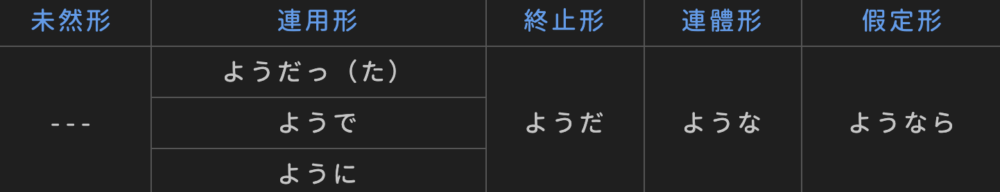

# ようだ　ような　ように

V / A1 / N＋の　＋　ようだ

与A2的变化形式相同，连用形ように　连体形ような

连用+V　连体+N

比喻，像...一样的

常跟着あたかも　いかにも　さながら　まるで　ちょうど

口语みたいだ　书面语ごとし

不能跟在A2之后

この雪はまるで綿のようです

新製品は面白いようによく売れる

彼はお前が思っているような人ではない

V原 / Vた　＋　かのようだ / に / な

就好像...一样

表实际上不是那样，实际感觉到像是那样，与事实矛盾或假想

犯人は事件のことを初めて聞いたかのような態度をとった

举例　像...那样

ように

私が発音するように後について言って下さい

先举例子，再如同这个例子一样。可与とおりに替换

ような

風邪をひちた時は蜜柑のようなビタミンを多く含む果物を食べるといい

包含前面名词诸如此类的东西举例

如下所示

次のように　下のように　右のように　左のように

結果は次のようにまとまることができる　结果归纳如下

---

V / A1 / A2 / N　＋　ようだ

N＋の / A2＋な　＋　ようだ

推测，好像、就像

说话人的印象或推测性判断，口语みたいだ

> あの人はこの大学の学生ではないようだ
>
> どうも風邪をひいtしまったようだ

ような気がする / ような感じがする　感觉好像

和上面表推测的ようだ类似

> 何となく不吉なとこが起こるような予感がした
>
> もう他に方法はないような気がする

ように思う / 感じる　感觉、印象，委婉陈述主张

ようでは　如果...的话，那就...

后面接负面

> 君が行かないようでは誰も行くわけがない

ようで(いて)　看上去像是...但实际上...

刚开始看是这样的印象，但实际上并非如此，类似ようだが

> 好きという気持ちを伝えるのは、簡単なようでいて実は難しい
>
> 毎日同じことの繰り返しのようで、実はそうではない

ようでもあり / ようでもあるし　即像是...又像是...

正反矛盾的感觉

> あの雲は羽根のようでもあり、かき氷のようでもあり、ずっと見てしまう

...ような...ような　又像...又像...

> 成功する可能性はあるようなないような

ようなら / ようだったら / ようであれば　要是...一样的话，表示假设

> このレベルが理解できないようなら、君才能ないよ
>
> 来られるようだったらぜひ来てください

---

V原 / Vない　＋　ように

目的，为了使该状态/状况促成而

前面多用 なる、できる 等与无意向行为的动词和 可能形、否定形 等状态性的表达方式，前后主语可一致可不一致。前面主语是意向性动作且主语一致时用 ために

> 忘れないようにノートにメモしておこう

劝告，轻微的命令

后面 しなさい、して下さい、お願いします 可省略

> 忘れ物をしないようにして下さい

Vます＋ように

祈愿，希望能...，但愿能...

后面可用祈る、念じる、望む、願う、希望する、期待する等，可以省略，に也可省略

> 明日は雨が降りませんように
>
> 全てがうまくいきますよう
>
> 息子が大学に合格できるよう神に祈った

间接引用，传达

后项常与 言う / 伝える 呼应，改动一些的间接引用

直接引用 命令/依赖＋と＋传达动词，照搬过来

> これからは遅刻しないように注意しておきました
>
> 戻りましたら家に電話するようお伝え下さい

ようにする

想办法做到...

以 使...状况成立 为目标而努力，当成为习惯时要用ようにしている

> 今は手が離せませんが、終わり次第できるだけ早く着くようにします
>
> 周りに迷惑が掛からないようにする
>
> 期待すると失望するから、初めから期待しないようにしている

ようになる

变得...的样子

由不能到能的转变，不做到做的转变，当持续转变继续进行的时候，用 ようになっている

> 自分の未来について少しだけ前向きに考えられるようになった
>
> うちの猫昔はあちこちでウンチしてたのに、今はちゃんとトイレでするようになってくれた
