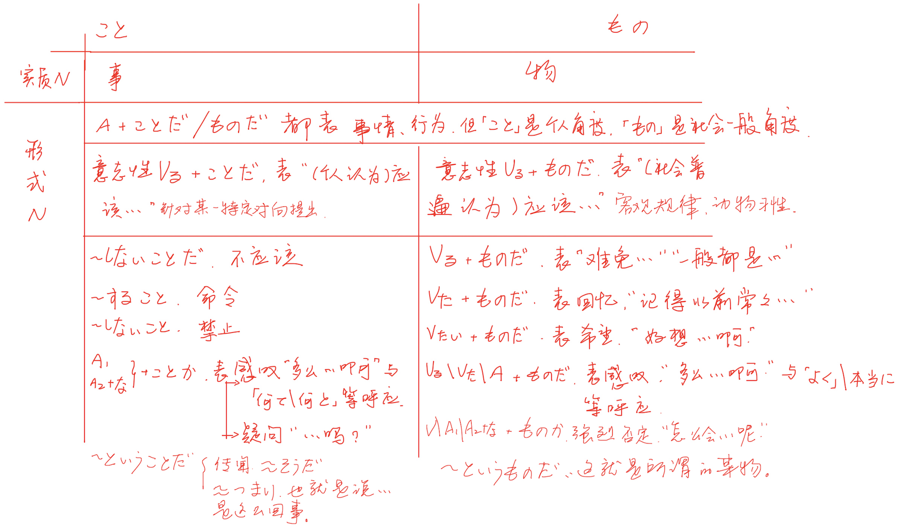

# ようだ　ような　ように

V / A1 / N＋の　＋　ようだ

よう与A2的变化形式相同，连用形ように　连体形ような

连用+V　连体+N

## 比喻

像...一样的

常跟着あたかも　いかにも　さながら　まるで　ちょうど

口语みたいだ　书面语ごとし

不能跟在A2之后

> この雪はまるで綿のようです
>
> 新製品は面白いようによく売れる
>
> 身を着るような寒さが続いている

 

V原 / Vた　＋　かのようだ / に / な

就好像...一样

表实际上不是那样，实际感觉到像是那样，与事实矛盾或假想

> 犯人は事件のことを初めて聞いたかのような態度をとった

## 举例

像...那样，如...所说，引言

ように

私が発音するように後について言って下さい

先举例子，再如同这个例子一样。可与とおりに替换

ような

風邪をひちた時は蜜柑のようなビタミンを多く含む果物を食べるといい

包含前面名词诸如此类的东西举例

ように

ご存知のように、日本は人口密度の高い国です

签名叙述的事情与后面要说的一致，可与とおりに替换

如下所示

次のように　下のように　右のように　左のように

結果は次のようにまとめることができる　结果归纳如下

---

## 推测，好像、就像

V / A1 / A2 / N　＋　ようだ

N＋の / A2＋な　＋　ようだ

说话人的印象或推测性判断，口语みたいだ

> あの人はこの大学の学生ではないようだ
>
> どうも風邪をひいtしまったようだ

ような気がする / ような感じがする　感觉好像

和上面表推测的ようだ类似

> 何となく不吉なとこが起こるような予感がした
>
> もう他に方法はないような気がする

ように思う / 感じる　感觉、印象，委婉陈述主张

ようでは　如果...的话，那就...

后面接负面

> 君が行かないようでは誰も行くわけがない

ようで(いて)　看上去像是...但实际上...

刚开始看是这样的印象，但实际上并非如此，类似ようだが

> 好きという気持ちを伝えるのは、簡単なようでいて実は難しい
>
> 毎日同じことの繰り返しのようで、実はそうではない

ようでもあり / ようでもあるし　即像是...又像是...

正反矛盾的感觉

> あの雲は羽根のようでもあり、かき氷のようでもあり、ずっと見てしまう

...ような...ような　又像...又像...

> 成功する可能性はあるようなないような

ようなら / ようだったら / ようであれば　要是...一样的话，表示假设

> このレベルが理解できないようなら、君才能ないよ
>
> 来られるようだったらぜひ来てください

## 目的、劝告、希望、传达

V原 / Vない　＋　ように

目的，为了使该状态/状况促成而

前面多用 なる、できる 等与无意向行为的动词和 可能形、否定形 等状态性的表达方式

前后主语可一致可不一致。前面主语是意向性动作且主语一致时用 ために

> 忘れないようにノートにメモしておこう

劝告，轻微的命令

请...，希望你...

后面 しなさい、して下さい、お願いします 可省略

> 忘れ物をしないようにして下さい

Vます＋ように

祈愿，希望能...，但愿能...，不针对人

后面可用祈る、念じる、望む、願う、希望する、期待する等，可以省略，に也可省略

> 明日は雨が降りませんように
>
> 全てがうまくいきますよう
>
> 息子が大学に合格できるよう神に祈った

间接引用，传达

后项常与 言う / 伝える 呼应，改动一些的间接引用

直接引用 命令/依赖＋と＋传达动词，照搬过来

> これからは遅刻しないように注意しておきました
>
> 戻りましたら家に電話するようお伝え下さい

ようにする

想办法做到...

以 使...状况成立 为目标而努力，当成为习惯时要用ようにしている

> 今は手が離せませんが、終わり次第できるだけ早く着くようにします
>
> 周りに迷惑が掛からないようにする
>
> 期待すると失望するから、初めから期待しないようにしている

ようになる

变得...的样子

由不能到能的转变，不做到做的转变，当持续转变继续进行的时候，用 ようになっている

> 自分の未来について少しだけ前向きに考えられるようになった
>
> うちの猫昔はあちこちでウンチしてたのに、今はちゃんとトイレでするようになってくれた

# みたい　らしい　そうだ

## みたい

目的、引用、变化、许愿、劝告都没有

### 比喻

#### 像...一样的

AみたいなB

可换成ような，只是说A类似B，不是A等于B

女みたいな人，表此人不是男的；らしい是典型性突出，女らしい人，有女人味的女人

> この薬はチュコレートみたいな味がする

#### 就像...

N / V みたいだ　

可换成ようだ

だ可省略

> 私が合格するなんて嘘みたい
>
> 君ってまるで子供みたいだね

#### 像...一样、列举相似的东西，实际不是这样，可是...

N / A1 / V みたいに

> 子供みたいに拗ねるのはやめろよ
>
> この服は買っても何年にもなるが、新品みたいにされいだ

#### 像...一样、虽然现实还不是这样，但几乎已成为事实

N みたいなものだ

Vた みたいなものだ

口语みたいなもんだ

> 僕の給料なんか、会社の儲けに比べたら、ただみたいなものだ

### 推测

好像

说话人主观推断，虽然不能清楚断定，但是却这么认为

以听来的简介信息推断时用らしい；直接传闻用そうだ；叙述摆在眼前的用そうだ

> 誰も彼女の本名を知らないみたいだ
>
> 高木さんは甘いものが嫌いみたいだ

### 举例

像...一样的

NみたいなN

Nみたいに

例如...的，像...那样的...

礼貌口语可以换成のような / ように

> 東京や大阪みたいな大都会には住みたくない
>
> 君みたいなあわて者、みたことがないよ

## らしい

### 像...一样的，典型的

N / A1 / A2 / V＋らしい

反复使用同一名词表示典型性

> あの人は本当に先生らしい先生ですね

N＋らしい

像...一样的，典型的

后一名词充分反映前一名词的典型性

> 今日は春らしい天気だ

### 推测

N / A1 / A2 / V ＋らしい

> 天気予報によると明日は雨らしい

天气预报没有直接说下雨，但根据预报的各种信息推测判断好像要下雨

间接信息推断

> 天気予報によると明日は雨だそうだ

天气预报说会下雨，直接照实描述天气预报的内容

直接转述

## そうだ

### 传闻

N / A2　＋　だそうだ

A1 / Vる　＋　そうだ

そうだ不能否定或过去式

> 昔、この辺りは海だったそうだ
>
> 予報では台風は今夜半に半島に上陸するそうだ

### 推测

A1词干 / A2 / V第一连用

＋　そうだ / に / な

＋　そうもない / そうにない / そうにもない

A1词干 / A2　＋　そうだ

好像、显得...似的

由所见做出的判断，但一看就明白的されいそうだ、赤いそうだ等时不用そうだ

与 一見、ちょっと見たところ等视觉同时用时，表 表面看如此，实际上未必如此

> そうの映画は面白そうだ
>
> あの人はお金がなさそうだ
>
> 今日は傘を持って行った方が良さそうだ

A1词干 / A2　＋　そうに見える

看上去显得...

> その問題は難しそうに見えるがやってみるとそうでもなかった
>
> なんだか気分が悪そうに見えますが大丈夫ですか

A1词干 / A2　＋　そうにしている

以显得...的情形做某动作

> 彼女はいつも恥ずかしそうにしている

### 发生的可能性

V第一连用　＋　そうだ

可能要、快要...

接在なる、落ちる等非意志动作或V可后，表很大可能性发生

与もうちょっとで、今にも一起，表某事即将发生

还可表程度严重

> 星が出でるから、明日は天気になりそうだ
>
> 暑くて死にそうだ

V第一连用　＋　そうになる

差点、险些

意志无法控制的现象即将发生，可与あやうく、あわや一起，表眼看就要...即将发生，有时可换Vるところだ

> びっくりして持っていたグラスを落としそうになった

V第一连用　＋　そうもない / そうにない

不太可能，发生某事的可能性极小

> この本は売れそうもない

### 很可能会要...

V第一连用　＋　そうだ

接第三人称有意识动作后，表某事很可能发生

一般不用于说话人自己的事情

> あの様子では二人はもう時期結婚しそうだ

### 也许会... 恐怕会...

Vて　＋　しまいそうだ

接有意识动作后，表恐怕会做出与自己意识相反的事情

用于说自己的行为

> 一度やめていたタバコをまた吸ってしまいそうだ

# っぽい　気味　がち　げ

## っぽい

N / V第一连用　＋　っぽい

有这种感觉或倾向，并没有真正发生

组合成新的A1

颜色名词＋っぽい

带有这种颜色或与这种颜色接近

白っぽい　发白的

V第一连用　＋　っぽい

某人容易...，爱...

怒りっぽい　易怒的

子供っぽい　＝　子供のようだ　像孩子似的(贬义)　子供らしい　天真活泼像孩子(褒义)

やくさっぽい　＝　やくさのようだ　像个流氓似的

女っぽい　＝　いかにも女という感じがする　给人感觉像女的

水っぽい 　水分过多(贬义)　水々しい　水灵灵的(褒义)

湿っぽい　湿漉漉的，阴郁的

熱っぽい　像发烧了似的

## 気味

稍微有点

有...的样子、倾向，多用于不好的场合

> 彼女は少し緊張気味だった

風邪気味

## がち

N　＋　がち

次数多，经常、总是、带有...倾向

容易产生这种状态，负面

V第一连用　＋　がち

容易...，往往会...

表即使无意也容易这样做，多用于负面

常与どうしても、つい、うっかり、Vてしまう一起使用

## げ

A1词干 / A2 / V第一连用　＋　げ

...的神情，...的样子，用于表情神态

只有ありげ前是动词   意味ありげ　意味深长的

可替换成〜そう

# ことだ　ものだ　ということだ　というものだ

とこ　事、言的训读，这么回事、这种说法

もの　物、者的训读，这么个东西、这种物

> のを　我听她唱过歌，听的是歌，不是事[抽象]，真的唱歌
>
> 彼女が歌を歌ったのを聞いたことがあります
>
> ことを　我听说她唱过歌，以前是歌手这回事[具体]，真的唱过
>
> 彼女が歌を歌ったことを聞いたことがあります
>
> と　我听有人说“她唱过歌”，她真的唱过吗我不确定
>
> 彼女が歌を歌ったと聞いたことがあります

表应该

ことだ　作为讲话人的个人意见提出的，我认为你应该...

ものだ　生活习惯、道德观点提出的，社会一般人都认为是个人就应该...

先生の言うことを聞くことだ　妈妈训孩子，你该听老师的话

先生の言うことを聞くものだ　平常讲道理，是个人就应该听老师的话

表不该

ないことだ　ものではない　固定句型可以互换

加强语气表该/不该

命令　すること

禁止　しないこと

无もの用法

表感叹

常搭配なんと　なんて　どんなに　＋　ことか

ものだ强烈感叹，真他妈牛逼

ものか不表感叹表强烈否定　二度といくものか　怎么还会去做第二次

と言うことだ

类似そうだ表传闻，直接引用，听说是这么回事，听说了这样的话

> 天気予報によると、明日は雨が降る**ということだ**
>
> 田中さんは通勤途中で交通事故に巻き込まれた**ということだ**

类似つまり表结论，前面所说的事情、动作行为可以得出结论，也就是说...这么个结论

> 父はまだ海外出張から帰ってきていない。つまり今日の私の卒業式には参加できない**と言うことだ**
>
> こんな時間になっても橋本くんは姿を現さない。今日も遅刻**ということだ**ね

と言うものだ

表解释

前面所说的那个词，解释起来就是...这么个东西

前面所说的那个东西解释起来就是...这个词的意思

> 続けるなら続ける。逃げるなら逃げる。それが覚悟**ってもんだ**
>
> 相手の話も聞かずに自分の主張だけ通そうとするなんて、それはわがまま**と言うものだ**
>
> 通す　贯穿始终，一年到头，通过...手段
>
> 通そうとする　V意＋とする　努力尝试...，想要做某事
>
> 自分の主張だけ通そうとする　只把自己的主张贯穿始终
>
> 即と言う言葉の意味だ
